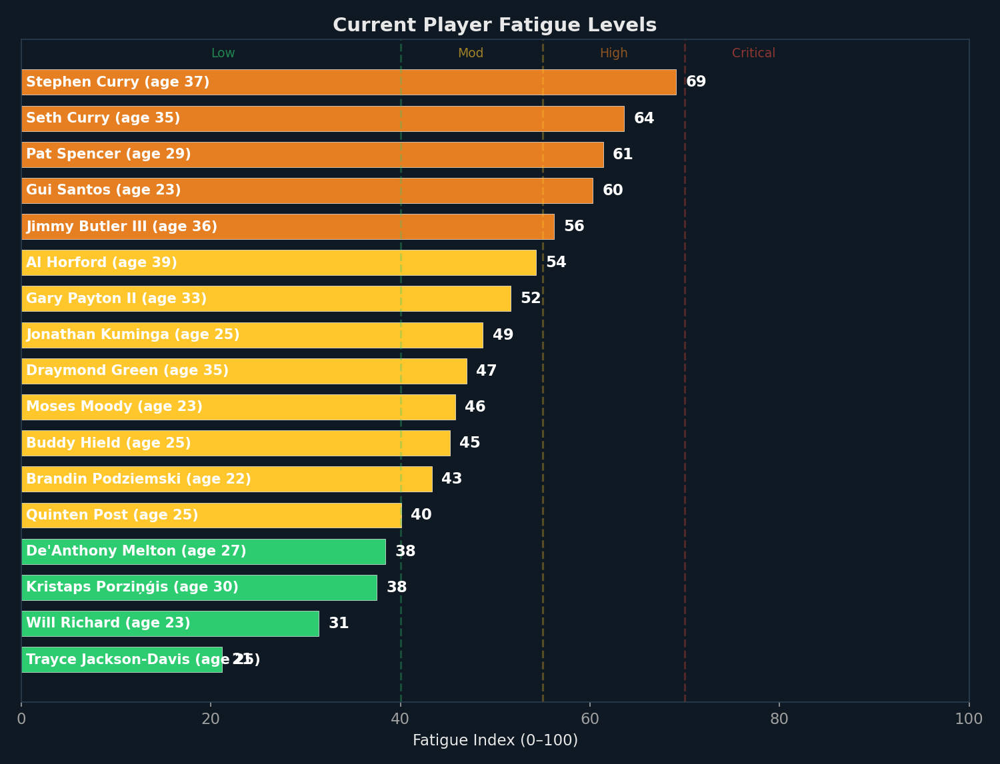
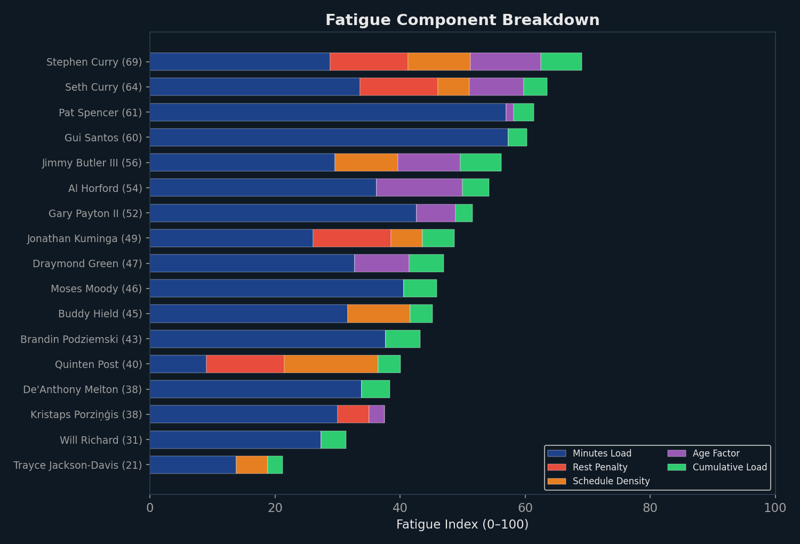
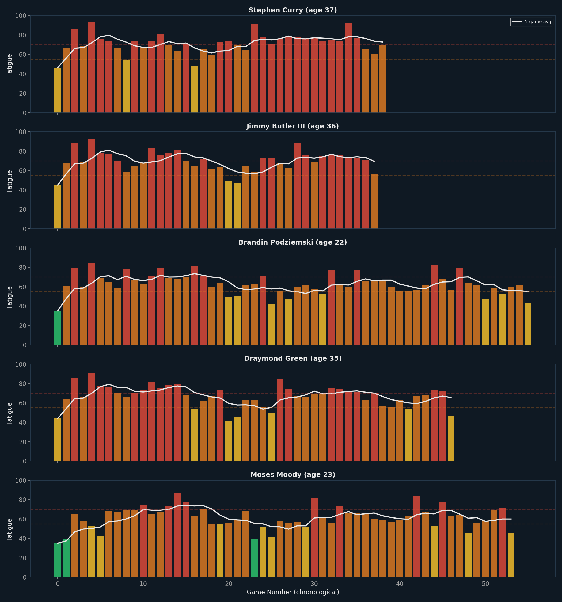
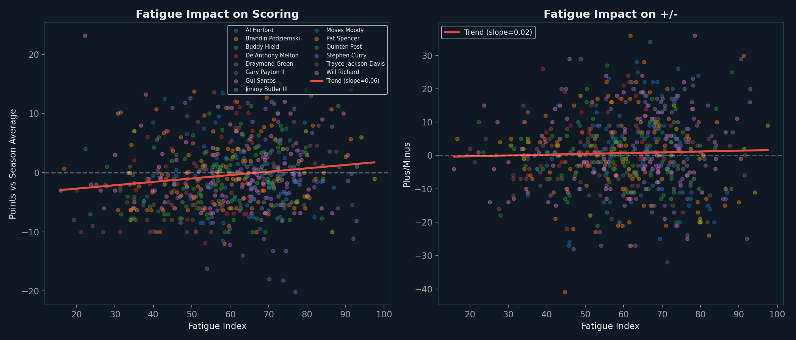
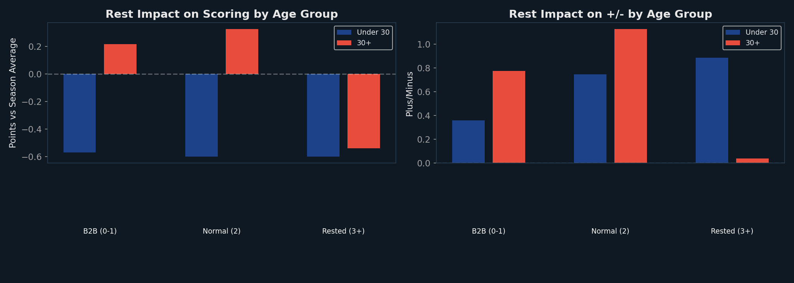

# Player Load & Fatigue Management Dashboard

*Generated: March 01, 2026 | Model: Weighted Fatigue Index + Ridge Regression Calibration*

This dashboard tracks player fatigue levels across the season, identifies fatigue-related
performance declines, and provides data-driven minutes management recommendations.

---

## 1. Current Fatigue Status

**What is the Fatigue Index?** A composite score (0–100) computed from five factors entering
each game: recent minutes load, rest days, schedule density, player age, and cumulative season
workload. Higher = more fatigued. The index uses only information available *before* tip-off.

**How to read this chart:** Each bar represents one player's fatigue level entering their most
recent game. Green = fresh (< 40), yellow = moderate (40–55), orange = elevated (55–70),
red = critical (> 70). Player age is shown in parentheses.



| Player | Age | Fatigue | L3 Avg Min | Rest Days | Recommendation |
|---|---|---|---|---|---|
| Stephen Curry | 37 | **69** | 30.0 | 2 | 🟠 Limit to 25 min |
| Seth Curry | 35 | **64** | 17.9 | 2 | 🟠 Limit to 12 min |
| Pat Spencer | 29 | **61** | 30.2 | 8 | 🟠 Limit to 12 min |
| Gui Santos | 23 | **60** | 28.6 | 8 | 🟠 Limit to 12 min |
| Jimmy Butler III | 36 | **56** | 30.7 | 4 | 🟠 Limit to 24 min |
| Al Horford | 39 | **54** | 25.1 | 8 | 🟡 Normal (20 min) |
| Gary Payton II | 33 | **52** | 18.8 | 8 | 🟡 Normal (13 min) |
| Jonathan Kuminga | 25 | **49** | 17.4 | 2 | 🟡 Normal (20 min) |
| Draymond Green | 35 | **47** | 28.9 | 8 | 🟡 Normal (26 min) |
| Moses Moody | 23 | **46** | 34.0 | 8 | 🟡 Normal (25 min) |
| Buddy Hield | 25 | **45** | 21.1 | 4 | 🟡 Normal (20 min) |
| Brandin Podziemski | 22 | **43** | 33.8 | 8 | 🟡 Normal (26 min) |
| Quinten Post | 25 | **40** | 5.1 | 2 | 🟡 Normal (17 min) |
| De'Anthony Melton | 27 | **38** | 24.7 | 8 | 🟢 Full workload (24 min max) |
| Kristaps Porziņģis | 30 | **38** | 23.9 | 3 | 🟢 Full workload (26 min max) |
| Will Richard | 23 | **31** | 17.5 | 10 | 🟢 Full workload (22 min max) |
| Trayce Jackson-Davis | 25 | **21** | 9.2 | 6 | 🟢 Full workload (23 min max) |

## 2. Fatigue Component Breakdown

**What is this chart?** Each player's fatigue index is decomposed into five weighted components.
This shows *why* a player is fatigued — whether it's heavy minutes, back-to-backs, age, or
cumulative season workload.

**The five components:**
- **Minutes Load (30%):** Recent 3-game average minutes divided by season average. >1.0 means playing heavier than usual.
- **Rest Penalty (25%):** Days since last game. Back-to-backs (0–1 days) get full penalty; 3+ days rest = no penalty.
- **Schedule Density (20%):** Number of games played in last 7 days. More games = more fatigue.
- **Age Factor (15%):** Players over 28 accumulate fatigue faster, scaling linearly to age 40.
- **Cumulative Load (10%):** Total minutes played this season as a fraction of maximum possible.



## 3. Season Fatigue Timeline

**How to read this chart:** Each panel tracks one player's fatigue index across every game of
the season. Bar color indicates severity (green/yellow/orange/red). The white line is a 5-game
rolling average. Look for upward trends that indicate accumulating fatigue, and spikes that
correspond to back-to-backs or dense schedule stretches.



## 4. Fatigue Impact on Performance

**What is this chart?** Each dot is one player-game. X-axis is the fatigue index *entering*
that game; Y-axis is how the player performed relative to their season average (positive =
above average, negative = below). The red trend line shows the overall relationship.

**What to look for:** A downward-sloping trend line confirms that higher fatigue predicts
worse performance. A steeper slope = stronger fatigue effect. If the slope is near zero,
fatigue has minimal impact on this metric.



### 4.1 Ridge Regression Calibration

A Ridge Regression model (R² = 0.049) quantifies which fatigue components most predict
scoring performance drops:

| Fatigue Component | Coefficient | Interpretation |
|---|---|---|
| Minutes Load | +4.547 | ↑ scoring per unit increase |
| Schedule Density | -1.526 | ↓ scoring per unit increase |
| Rest Penalty | +1.297 | ↑ scoring per unit increase |
| Cumulative Load | +0.875 | ↑ scoring per unit increase |
| Age Factor | +0.431 | ↑ scoring per unit increase |

> *R² = 0.049 means the fatigue model explains 4.9% of the variance in scoring*
> *deviations from season averages.*

## 5. Rest Day Impact by Age Group

**What is this chart?** Performance split by rest days (B2B vs normal vs well-rested) and age
group (under 30 vs 30+). This reveals whether veteran players need more rest than younger ones.

**What to look for:** If the 30+ bars are significantly lower on B2Bs compared to rested games,
the coaching staff should prioritize resting veterans on back-to-backs.



## 6. Load Management Recommendations

### ⚠️ Immediate Attention Required

- **Stephen Curry** (age 37, fatigue: 69) — 🟠 Limit to 25 min
- **Seth Curry** (age 35, fatigue: 64) — 🟠 Limit to 12 min
- **Pat Spencer** (age 29, fatigue: 61) — 🟠 Limit to 12 min
- **Gui Santos** (age 23, fatigue: 60) — 🟠 Limit to 12 min
- **Jimmy Butler III** (age 36, fatigue: 56) — 🟠 Limit to 24 min

### 🧓 Veteran Management Plan

- **Al Horford** (age 39, 20.8 mpg): Consider capping at 17 min on B2Bs; rest 1 in every 5 B2B games
- **Stephen Curry** (age 37, 31.3 mpg): Consider capping at 26 min on B2Bs; rest 1 in every 5 B2B games
- **Jimmy Butler III** (age 36, 31.1 mpg): Consider capping at 26 min on B2Bs; rest 1 in every 5 B2B games
- **Seth Curry** (age 35, 16.0 mpg): Consider capping at 13 min on B2Bs; rest 1 in every 5 B2B games
- **Draymond Green** (age 35, 26.5 mpg): Consider capping at 22 min on B2Bs; rest 1 in every 5 B2B games
- **Gary Payton II** (age 33, 13.2 mpg): Consider capping at 11 min on B2Bs; rest 1 in every 5 B2B games

### 📋 General Principles

1. **Back-to-back rule:** No player over 33 should exceed 85% of their season average minutes on B2Bs
2. **3-in-5 rule:** When the team plays 3 games in 5 days, rest at least one starter per game
3. **Fatigue threshold:** Any player crossing fatigue index 70 should be considered for a rest game
4. **Monitor trend:** If a player's 5-game rolling fatigue average exceeds 60, proactively reduce minutes

---

## Appendix: Fatigue Index Formula

```
FATIGUE_INDEX = 30% × MINUTES_LOAD
             + 25% × REST_PENALTY
             + 20% × SCHEDULE_DENSITY
             + 15% × AGE_FACTOR
             + 10% × CUMULATIVE_LOAD

Where:
  MINUTES_LOAD     = (L3 avg minutes) / (season avg minutes)    [0–2]
  REST_PENALTY     = 1.0 if B2B, 0.5 if 1-day, 0.2 if 2-day   [0–1]
  SCHEDULE_DENSITY = (games in last 7 days) / 4                 [0–1]
  AGE_FACTOR       = max(0, (age − 28) / 12)                   [0–1]
  CUMULATIVE_LOAD  = (total min played) / (GP × 48)            [0–1]
```

---
*Generated: March 01, 2026 | Data: stats.nba.com 2025-26*