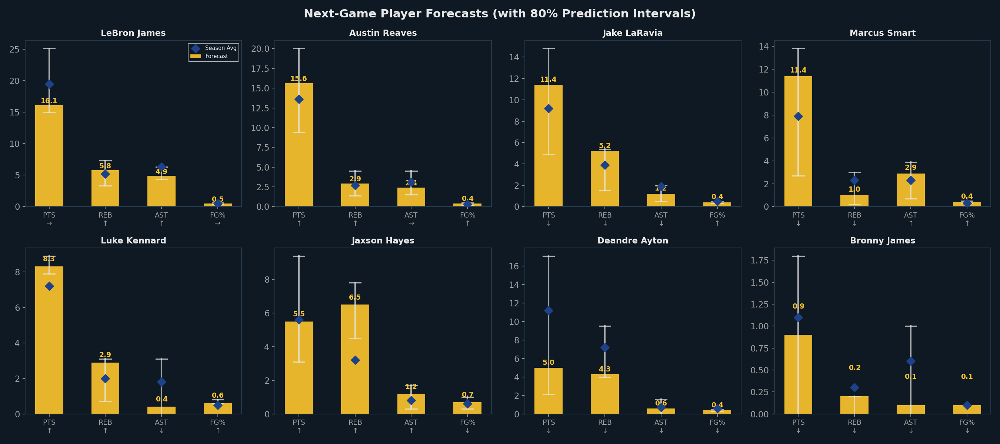

# 🏀 GSIS Game-Day Intelligence Brief
## LAL @ PHX — Feb 26, 2026

*Generated: March 01, 2026 13:12 | System: Game Strategy Intelligence System (GSIS)*
*Team: LAL | Venue: Away | Models: 5 interconnected ML systems*

---

## 📋 Executive Summary

**Top Game-Day Priorities:**

1. ⚠️ **Monitor fatigue** for Dončić, James, Ayton — consider minutes restrictions
2. 🔥 **Ride the hot hand**: Reaves, Hayes, Kennard trending above season averages
3. 📉 **Cold streak watch**: Thiero, James, Knecht — adjust expectations / increase touches
4. 🏀 **Optimal lineup available**: projected +29.4 net rating

---

## 1. Pre-Game Win Probability (M1)

*Full analysis: [pregame_win_predictor.md](pregame_win_predictor.md)*

The stacked ensemble (XGBoost + LightGBM + Logistic Regression) provides a calibrated
win probability using only pre-game information (recent form, rest, opponent quality, etc.).

## 2. Opponent Scouting Report (M3)

*Full analysis: [opponent_scouting.md](opponent_scouting.md)*

**Opponent: PHX**

The K-Means archetype classifier has categorized all 30 teams by playing style.
See the full scouting report for this opponent's archetype, profile, and recommended
counter-strategies.

## 3. Lineup Recommendations (M2)

*Full analysis: [lineup_recommendations.md](lineup_recommendations.md)*

### 🏀 Recommended Starting Lineup

**Austin Reaves — Dalton Knecht — Jake LaRavia — Jaxson Hayes — Maxi Kleber**
- Predicted Net Rating: **+29.4**
- Off: 123.9 | Def: 96.1

### 🛡️ Best Defensive Lineup

**Austin Reaves — Dalton Knecht — Jaxson Hayes — Marcus Smart — Maxi Kleber**
- Def Rating: **96.0** | Net: +29.0

## 4. Player Performance Forecasts (M4)

*Full analysis: [player_forecasts.md](player_forecasts.md)*

| Player | PTS Forecast | REB | AST | Trend |
|---|---|---|---|---|
| LeBron James | **16.1** [15–25] | 5.8 | 4.9 | → |
| Austin Reaves | **15.6** [9–20] | 2.9 | 2.4 | ↑ |
| Jake LaRavia | **11.4** [5–15] | 5.2 | 1.2 | ↓ |
| Marcus Smart | **11.4** [3–14] | 1.0 | 2.9 | ↓ |
| Luke Kennard | **8.3** [8–9] | 2.9 | 0.4 | ↑ |
| Jaxson Hayes | **5.5** [3–9] | 6.5 | 1.2 | ↑ |
| Deandre Ayton | **5.0** [2–17] | 4.3 | 0.6 | ↓ |
| Bronny James | **0.9** [0–2] | 0.2 | 0.1 | ↓ |

## 5. Fatigue & Load Management (M5)

*Full analysis: [fatigue_dashboard.md](fatigue_dashboard.md)*

| Player | Fatigue Index | Zone | Recommendation |
|---|---|---|---|
| Luka Dončić | 🔴 **88** | Red | 🔴 REST or hard cap at 12 min |
| LeBron James | 🔴 **79** | Red | 🔴 REST or hard cap at 19 min |
| Deandre Ayton | 🟠 **63** | Orange | 🟠 Limit to 22 min |
| Marcus Smart | 🟠 **63** | Orange | 🟠 Limit to 22 min |
| Austin Reaves | 🟠 **61** | Orange | 🟠 Limit to 26 min |
| Luke Kennard | 🟠 **59** | Orange | 🟠 Limit to 16 min |
| Rui Hachimura | 🟠 **57** | Orange | 🟠 Limit to 23 min |
| Jake LaRavia | 🟡 **53** | Yellow | 🟡 Normal (26 min) |
| Maxi Kleber | 🟡 **49** | Yellow | 🟡 Normal (11 min) |
| Jarred Vanderbilt | 🟡 **48** | Yellow | 🟡 Normal (19 min) |

## 6. Tactical Takeaways

Based on the integrated GSIS analysis:

1. **Feed Reaves** — forecasted for 16 PTS, trending above season average
2. **Manage Dončić's minutes** — fatigue index 88, consider <25 min
3. **Closing lineup**: Reaves, Knecht, LaRavia, Hayes, Kleber (Net: +29.4)

---

## 7. Glossary

| Term | Definition |
|---|---|
| Net Rating | Points scored minus points allowed per 100 possessions |
| Off Rating | Points scored per 100 possessions |
| Def Rating | Points allowed per 100 possessions (lower = better) |
| Fatigue Index | 0–100 scale (0=fresh, 100=exhausted) based on minutes, rest, age |
| SHAP | Feature importance method showing each factor's contribution to prediction |
| Archetype | Team playing-style cluster from K-Means algorithm |
| Stacked Ensemble | Combining multiple ML models via a meta-learner for better predictions |
| Quantile Regression | Predicts ranges (80% CI) instead of single point estimates |
| 80% CI | 80% prediction interval — true value falls in this range 80% of the time |
| L5/L10 | Rolling average over last 5 or 10 games |

---

*GSIS v1.0 — March 01, 2026 | 5 Models | 13:12 | LAL*