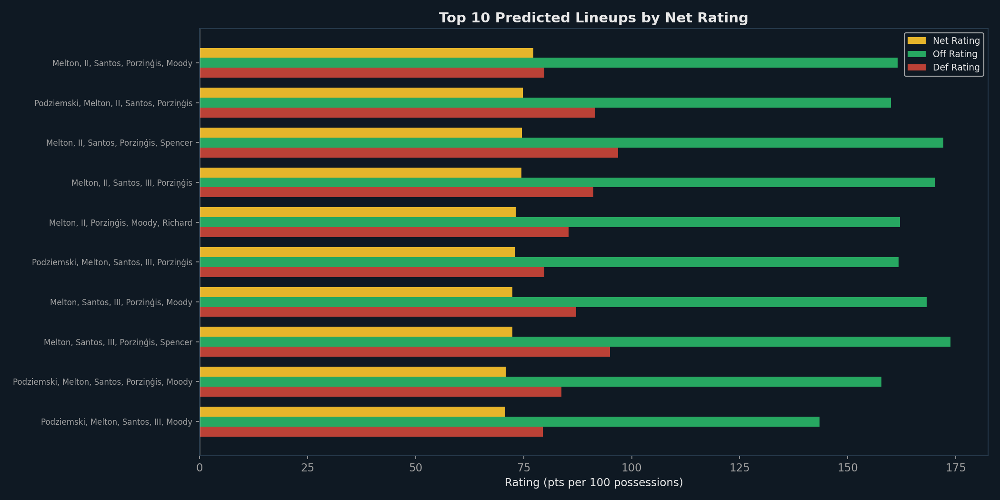
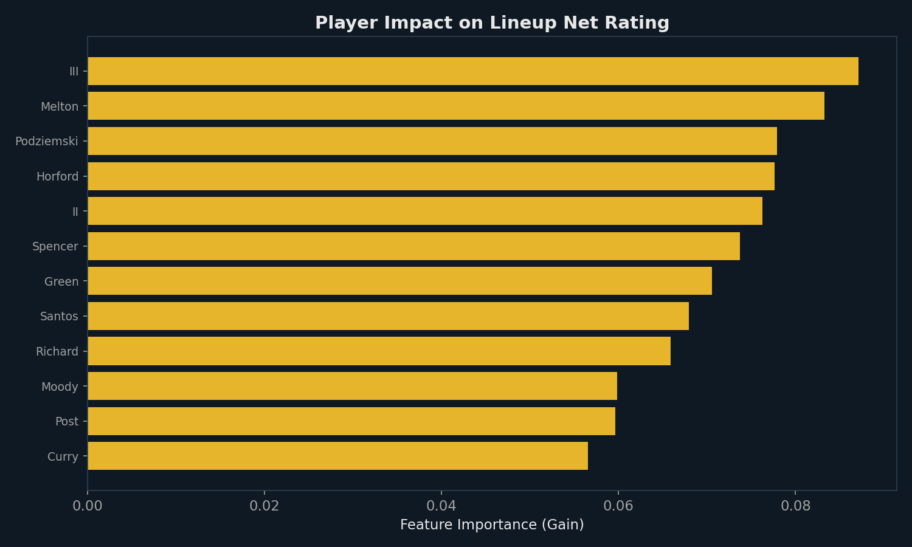
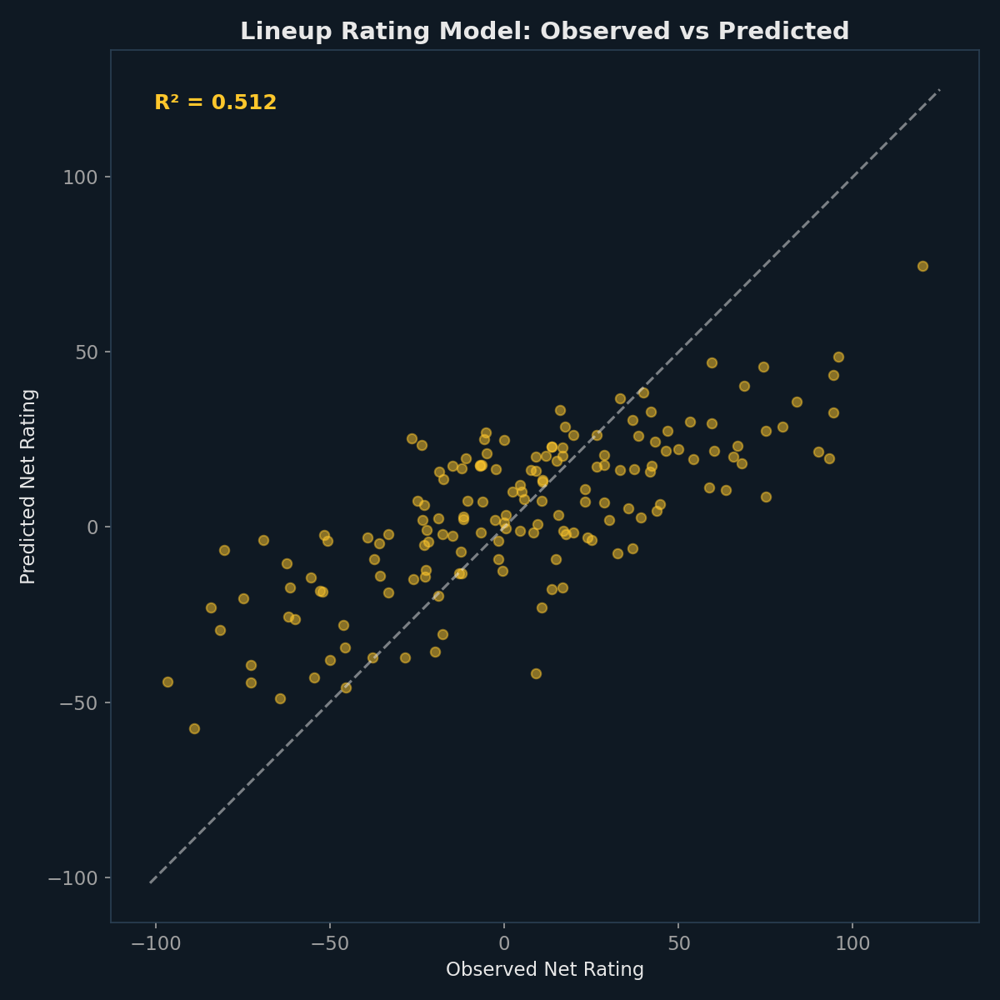
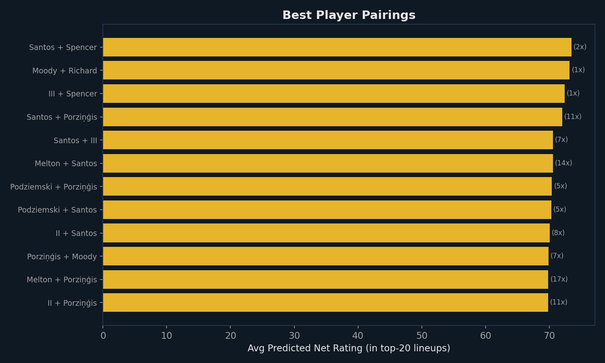

# Dynamic Lineup Optimizer

*Generated: March 01, 2026 | Model: XGBoost Regressors for Net/Off/Def Rating*

This module trains XGBoost models on observed 5-man lineup data, then scores **every valid
combination** of available rotation players to find optimal lineups. Three separate models predict
net, offensive, and defensive ratings — enabling lineup recommendations optimized for different game situations.

---

## 1. Top Recommended Lineups

**How to read:** Lineups ranked by predicted net rating (offense − defense). Gold = net rating,
green = offensive rating, red = defensive rating. Higher net = more dominant.

### 🏀 Best Overall Lineup

**De'Anthony Melton — Gary Payton II — Gui Santos — Kristaps Porziņģis — Moses Moody**
- Predicted Net Rating: **+77.3**
- Off Rating: 161.5 | Def Rating: 79.8

### 🛡️ Best Defensive Lineup

**Brandin Podziemski — De'Anthony Melton — Gary Payton II — Gui Santos — Moses Moody**
- Def Rating: **77.3** | Net Rating: +62.1

### 🔥 Best Offensive Lineup

**De'Anthony Melton — Gui Santos — Jimmy Butler III — Kristaps Porziņģis — Pat Spencer**
- Off Rating: **173.8** | Net Rating: +72.4

### Complete Top-10 Rankings

| Rank | Lineup | Net | Off | Def |
|---|---|---|---|---|
| 1 | Melton, II, Santos, Porziņģis, Moody | +77.3 | 161.5 | 79.8 |
| 2 | Podziemski, Melton, II, Santos, Porziņģis | +74.8 | 160.0 | 91.6 |
| 3 | Melton, II, Santos, Porziņģis, Spencer | +74.6 | 172.1 | 96.9 |
| 4 | Melton, II, Santos, III, Porziņģis | +74.5 | 170.1 | 91.1 |
| 5 | Melton, II, Porziņģis, Moody, Richard | +73.2 | 162.1 | 85.4 |
| 6 | Podziemski, Melton, Santos, III, Porziņģis | +73.0 | 161.7 | 79.8 |
| 7 | Melton, Santos, III, Porziņģis, Moody | +72.4 | 168.2 | 87.2 |
| 8 | Melton, Santos, III, Porziņģis, Spencer | +72.4 | 173.8 | 95.0 |
| 9 | Podziemski, Melton, Santos, Porziņģis, Moody | +70.9 | 157.8 | 83.8 |
| 10 | Podziemski, Melton, Santos, III, Moody | +70.8 | 143.5 | 79.5 |

## 2. Player Impact on Lineup Quality

**How to read:** Feature importance from the XGBoost net-rating model shows which players
most influence lineup quality. Higher importance = this player's presence/absence has the
largest effect on whether a lineup is predicted to have a high or low net rating.

## 3. Model Calibration

**How to read:** Each dot is an observed lineup. If the model were perfect, all dots would lie
on the dashed diagonal. The R² value tells us how much variance in actual lineup performance
the model captures.

- **Training R²:** 0.512
- **CV MAE:** 40.1
- **Lineups in training data:** 159

## 4. Best Player Pairings

**How to read:** Which 2-player combinations appear most frequently in the top-20 predicted lineups
and have the highest average net rating? These are your highest-synergy duos.

---
*Generated: March 01, 2026 | Data: stats.nba.com 2025-26*