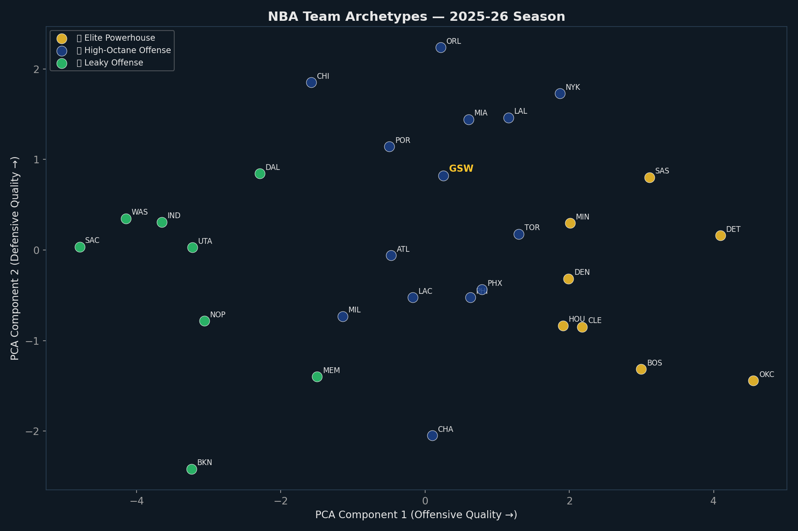
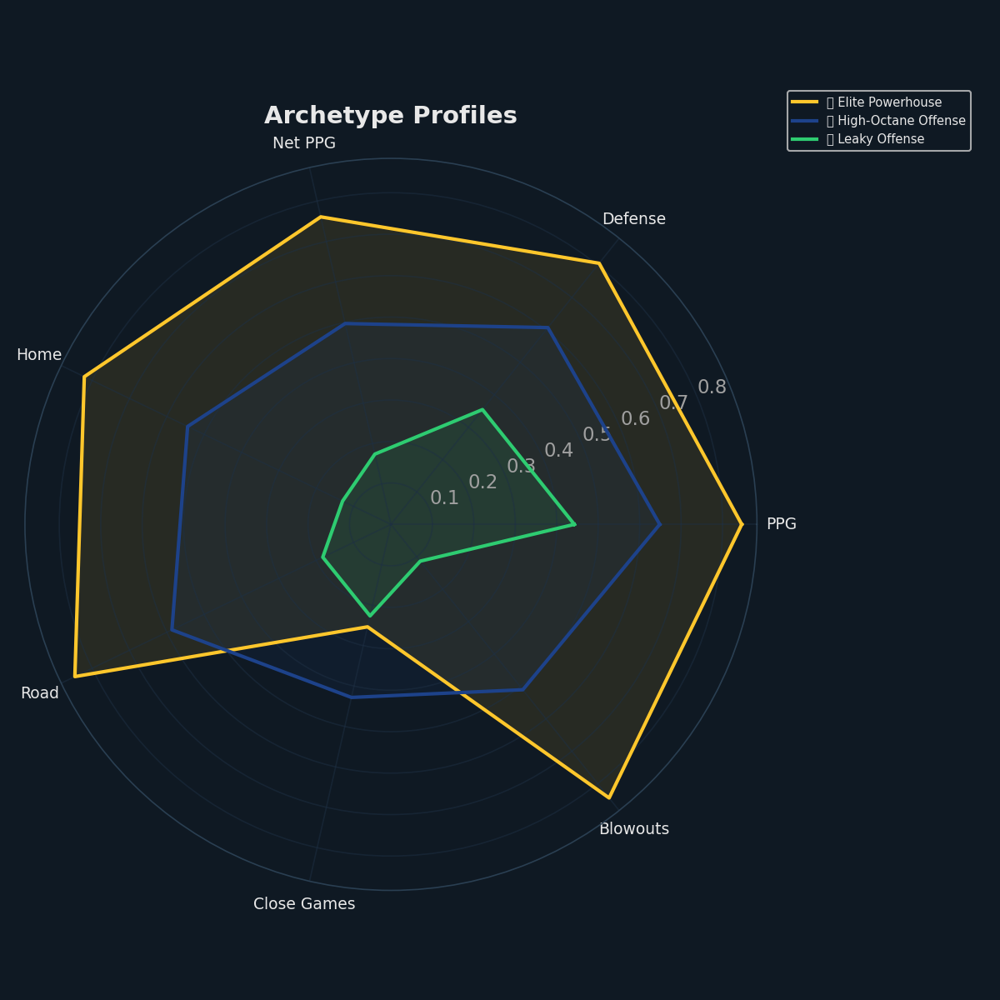
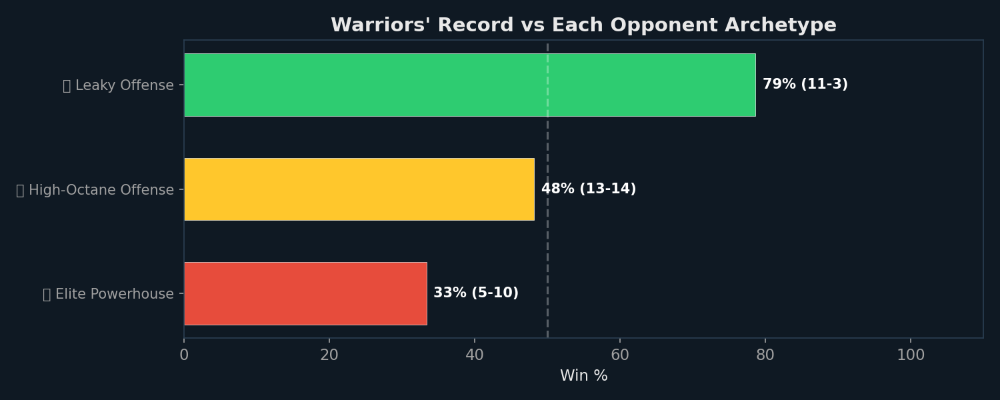
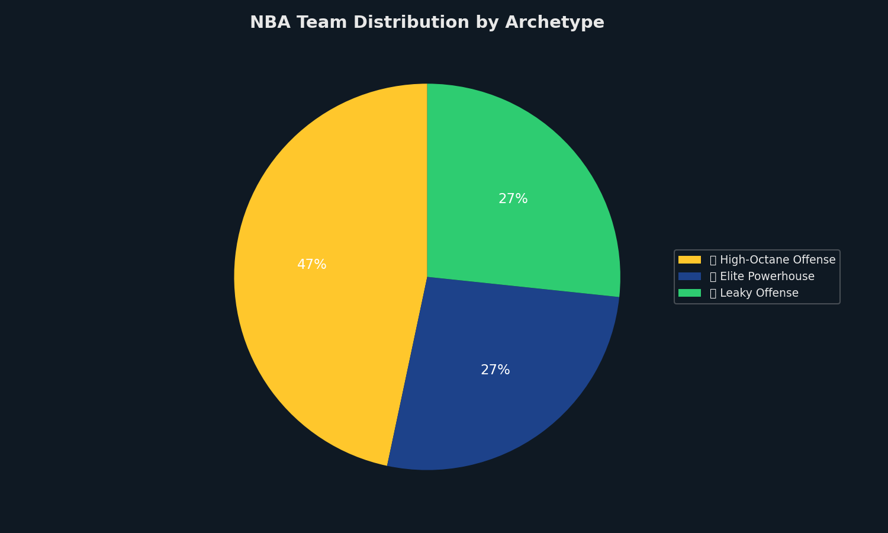

# Opponent Archetype Scouting Report

*Generated: March 01, 2026 | Model: K-Means Clustering (k=3, silhouette=0.251)*

This report classifies all 30 NBA teams into playing-style archetypes using unsupervised
machine learning, then maps each archetype to a Warriors counter-strategy based on historical
performance data.

---

## 1. NBA Team Landscape

**What is this chart?** Every NBA team is plotted on a 2D map using PCA (Principal Component Analysis)
to compress 9 team-level features into two dimensions. Teams that are close together play similar styles.
Colors represent the 3 discovered archetypes. The Warriors (GSW) are highlighted in gold.

**How to read it:** Teams in the same cluster will require similar game plans. The X-axis roughly
captures offensive quality (right = better offense), while the Y-axis captures defensive quality
(up = better defense). Teams in the upper-right are the elite two-way teams.

## 2. Archetype Profiles

**What is this chart?** A radar chart comparing the average profile of each archetype across 7
dimensions: scoring volume, defensive quality, net PPG, home strength, road strength, close-game
ability, and blowout rate. Larger shapes indicate stronger overall teams.

### 🎯 High-Octane Offense

**Teams (14):** New York Knicks, Los Angeles Lakers, Toronto Raptors, Phoenix Suns, Philadelphia 76ers, Orlando Magic, Miami Heat, Golden State Warriors, LA Clippers, Portland Trail Blazers, Atlanta Hawks, Charlotte Hornets, Milwaukee Bucks, Chicago Bulls

Avg: 115.4 PPG | 115.1 OPP PPG | Net: +0.4 | Win%: 52.1%

### 🏃 Elite Powerhouse

**Teams (8):** Detroit Pistons, Oklahoma City Thunder, San Antonio Spurs, Boston Celtics, Houston Rockets, Denver Nuggets, Cleveland Cavaliers, Minnesota Timberwolves

Avg: 118.0 PPG | 111.5 OPP PPG | Net: +6.5 | Win%: 67.0%

### 🔥 Leaky Offense

**Teams (8):** Memphis Grizzlies, Dallas Mavericks, Utah Jazz, Brooklyn Nets, Washington Wizards, New Orleans Pelicans, Indiana Pacers, Sacramento Kings

Avg: 112.8 PPG | 119.6 OPP PPG | Net: -7.0 | Win%: 29.4%

---

## 3. Warriors' Performance vs Each Archetype

**How to read this chart:** Each bar shows the Warriors' win percentage against teams in that
archetype. Green = above .500 (winning matchup), red = below .500 (losing matchup),
gold = roughly even. The record (W-L) is shown alongside each bar.

## 4. Counter-Strategy Playbook

For each archetype, here are data-driven tactical recommendations based on the Warriors'
historical performance:

### 🔥 Leaky Offense

**Record:** 11-3 (79%) — ✅ Strong

**Counter-Strategy:**
1. Match their pace with uptempo play
2. Prioritize 3PT defense (close out aggressively)
3. Push transition offense — attack before defense sets

*Teams: Memphis Grizzlies, Dallas Mavericks, Utah Jazz, Brooklyn Nets, Washington Wizards, New Orleans Pelicans, +2 more*

### 🎯 High-Octane Offense

**Record:** 13-14 (48%) — ⚠️ Neutral

**Counter-Strategy:**
1. Match their pace with uptempo play
2. Prioritize 3PT defense (close out aggressively)
3. Push transition offense — attack before defense sets

*Teams: New York Knicks, Toronto Raptors, Los Angeles Lakers, Philadelphia 76ers, Phoenix Suns, Orlando Magic, +8 more*

### 🏃 Elite Powerhouse

**Record:** 5-10 (33%) — ❌ Struggling

**Counter-Strategy:**
1. Maximize Curry PnR to create mismatches
2. Target < 12 turnovers (elite teams capitalize on mistakes)
3. Slow the pace — limit transition opportunities

*Teams: Detroit Pistons, Oklahoma City Thunder, San Antonio Spurs, Boston Celtics, Houston Rockets, Denver Nuggets, +2 more*

## 5. League Archetype Distribution

## 6. Warriors' Own Archetype

The Warriors are classified as: **🎯 High-Octane Offense**

- Record: 29-27 (51.8%)
- PPG: 115.0 | OPP PPG: 114.0 | Net: +2.0

Teams in the same archetype as the Warriors:
- New York Knicks (35-21, 62.5%)
- Los Angeles Lakers (33-21, 61.1%)
- Toronto Raptors (33-23, 58.9%)
- Phoenix Suns (32-24, 57.1%)
- Philadelphia 76ers (30-25, 54.5%)
- Orlando Magic (29-25, 53.7%)
- Miami Heat (29-27, 51.8%)
- LA Clippers (27-28, 49.1%)
- Portland Trail Blazers (27-29, 48.2%)
- Atlanta Hawks (27-30, 47.4%)
- Charlotte Hornets (26-30, 46.4%)
- Milwaukee Bucks (23-30, 43.4%)
- Chicago Bulls (24-32, 42.9%)

---
*Generated: March 01, 2026 | Data: stats.nba.com 2025-26*