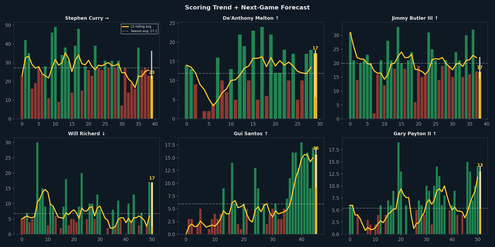
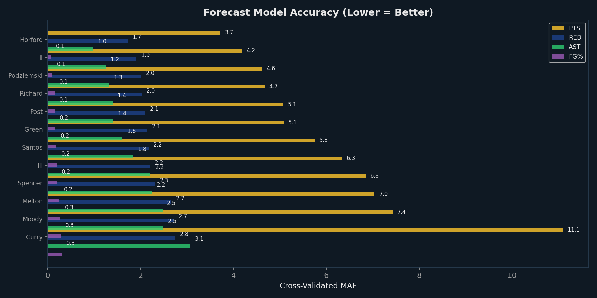

# Player Performance Forecaster

*Generated: March 01, 2026 | Model: Per-Player XGBoost Regressors with Quantile Intervals*

Individual XGBoost models trained on each player's game-by-game history predict their next-game
stat line. Features include rolling averages (L3/L5/L10), trends, rest days, home/away, and
game context. Quantile regression provides 80% prediction intervals.

---

## 1. Next-Game Forecasts

**How to read this chart:** Each card shows one player's predicted stats for the next game.
Gold bars = point forecast. White error bars = 80% prediction interval (the true value will fall
in this range 80% of the time). Blue diamonds = season average for comparison. Arrows below each
stat show the trend (↑ = L5 avg > season avg, ↓ = below, → = stable).

| Player | PTS | REB | AST | FG% | PTS Trend |
|---|---|---|---|---|---|
| Stephen Curry | **23.0** [22–36] | 1.5 [1–5] | 2.3 [2–6] | 50.0% | → |
| De'Anthony Melton | **17.1** [6–18] | 3.1 [3–5] | 1.3 [0–2] | 40.0% | ↑ |
| Jimmy Butler III | **16.9** [15–22] | 3.5 [3–7] | 4.6 [3–5] | 50.0% | ↑ |
| Will Richard | **16.8** [3–17] | 4.6 [0–5] | 1.8 [0–2] | 50.0% | ↓ |
| Gui Santos | **15.6** [9–17] | 5.4 [1–6] | 2.2 [1–3] | 50.0% | ↑ |
| Gary Payton II | **13.0** [6–14] | 2.8 [1–5] | 2.1 [1–4] | 60.0% | ↑ |
| Brandin Podziemski | **11.8** [7–13] | 6.6 [4–7] | 5.5 [2–6] | 50.0% | → |
| Moses Moody | **11.1** [8–14] | 3.1 [2–4] | 1.9 [1–4] | 40.0% | ↑ |
| Quinten Post | **10.2** [8–12] | 3.3 [3–4] | 2.0 [0–2] | 50.0% | ↓ |
| Pat Spencer | **4.9** [0–9] | 2.2 [1–4] | 5.8 [2–7] | 40.0% | ↑ |
| Al Horford | **4.8** [5–8] | 7.2 [3–8] | 3.9 [2–4] | 40.0% | ↑ |
| Draymond Green | **1.1** [0–13] | 3.0 [2–5] | 2.8 [3–5] | 30.0% | ↑ |
| Kristaps Porziņģis | — | — | — | — | → |

## 2. Scoring Trends + Forecast

**How to read this chart:** Each panel tracks a player's game-by-game scoring (green = above
average, red = below). The gold line is the 5-game rolling average. The final gold bar with
error bar is the forecast for the *next* game. Compare the forecast to the season average
(dashed line) to see if the player is trending up or down.

## 3. Model Accuracy

**How to read this chart:** Cross-validated Mean Absolute Error (MAE) for each player-stat model.
Lower bars = more accurate predictions. For context, a PTS MAE of 6.0 means the model's
predictions are off by ±6 points on average. For FG%, divide by 100 (MAE of 0.08 = ±8% FG%).

## 4. Trend Alerts

### 🔥 Hot Streaks (L5 > Season Average)

- **Gui Santos**: L5 avg 15.0 vs season 6.0 (**+9.0**) — forecast: 15.6
- **Pat Spencer**: L5 avg 13.0 vs season 6.3 (**+6.7**) — forecast: 4.9
- **Gary Payton II**: L5 avg 11.8 vs season 5.4 (**+6.4**) — forecast: 13.0
- **Moses Moody**: L5 avg 14.8 vs season 11.5 (**+3.3**) — forecast: 11.1
- **Jimmy Butler III**: L5 avg 22.0 vs season 20.0 (**+2.0**) — forecast: 16.9
- **De'Anthony Melton**: L5 avg 13.4 vs season 11.9 (**+1.5**) — forecast: 17.1
- **Al Horford**: L5 avg 8.8 vs season 7.5 (**+1.3**) — forecast: 4.8
- **Draymond Green**: L5 avg 9.0 vs season 8.4 (**+0.6**) — forecast: 1.1

### ⚠️ Cold Streaks (L5 < Season Average)

- **Quinten Post**: L5 avg 4.4 vs season 7.7 (**-3.3**) — forecast: 10.2
- **Will Richard**: L5 avg 6.0 vs season 6.8 (**-0.8**) — forecast: 16.8

---
*Models: 13 players × 4 stats = 52 individual XGBoost models*
*Generated: March 01, 2026 | Data: stats.nba.com 2025-26*