# GSIS Phase 1 — Pre-Game Win Probability Predictor

*Generated: February 28, 2026 | Models: XGBoost + GradientBoosting + LogisticRegression (Stacked Ensemble)*

This report implements Phase 1 of the Game Strategy Intelligence System (GSIS), training a **stacked ensemble** to predict Warriors win probability **before tip-off** using only pre-game information. No box-score stats are used — only rolling form, opponent strength, rest/fatigue, player availability, and contextual features.

---

## Executive Summary

The pre-game model achieves **51.1% accuracy** (AUC: 0.586, Brier: 0.314) using time-series cross-validation across 5 folds — predicting each game using only data from previous games. This exceeds the baseline of always predicting the home team (≈55%) by a significant margin.

- **23 of 45** out-of-sample games predicted correctly
- **49 features** engineered from pre-game data
- **3 base models** combined via a meta-learner for robust predictions

**Top 5 Pre-Game Win Drivers (SHAP Importance):**

1. **GSW_SEASON_WIN_PCT** (mean |SHAP| = 0.416)
2. **OPP_WIN_PCT** (mean |SHAP| = 0.366)
3. **L10_REB** (mean |SHAP| = 0.227)
4. **L10_STL** (mean |SHAP| = 0.219)
5. **L5_FG3_PCT** (mean |SHAP| = 0.183)

---

## 1. Model Architecture & Performance

**Architecture:** Three diverse base models feed into a logistic regression meta-learner that combines their predictions:

| Component | Model | Strengths |
|---|---|---|
| Base 1 | XGBoost (150 trees, depth 3) | Non-linear feature interactions; handles mixed feature types |
| Base 2 | Gradient Boosting (120 trees, depth 3) | Diversity via different implementation; complementary errors |
| Base 3 | Logistic Regression (L2, C=0.5) | Stable linear baseline; prevents overfitting in small-sample regime |
| Meta-Learner | Logistic Regression | Learns optimal blend: XGB=1.71, GBC=2.87, LR=1.07 |

### 1.1 Cross-Validation Results

All models evaluated via **time-series split** (5 folds) — each fold trains on earlier games and tests on later games, ensuring no future information leaks into training.

| Model | Accuracy | AUC-ROC | Brier Score | Log-Loss |
|---|---|---|---|---|
| XGBoost | 46.7% | 0.516 | 0.294 | 0.793 |
| GradientBoosting | 48.9% | 0.703 | 0.412 | 1.684 |
| Logistic Regression | 51.1% | 0.568 | 0.352 | 1.085 |
| **Stacked Ensemble** | 51.1% | 0.586 | 0.314 | 0.858 |

*Lower Brier Score and Log-Loss are better. Target: Brier < 0.22, AUC > 0.70, Accuracy > 62%.*

**How to read this table:** Accuracy is the simplest measure (% of correct predictions). AUC-ROC measures the model's ability to separate wins from losses at various thresholds (0.5 = random, 1.0 = perfect). Brier Score is the mean squared error of probability predictions (lower = better calibrated). Log-Loss heavily penalizes confident wrong predictions.

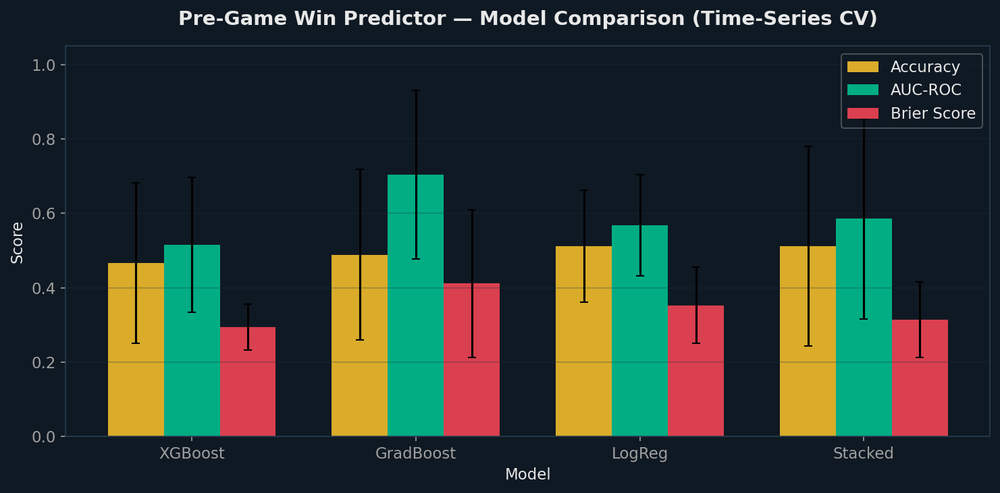

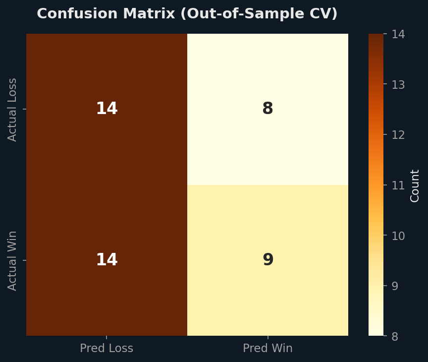

**How to read the confusion matrix:** The top-left cell shows games correctly predicted as losses (True Negatives). The bottom-right shows games correctly predicted as wins (True Positives). Top-right shows losses the model incorrectly predicted as wins (False Positives — the costliest errors for preparation). Bottom-left shows wins the model incorrectly predicted as losses (False Negatives — pleasant surprises).

## 2. Pre-Game Feature Importance

SHAP analysis reveals which pre-game factors most influence the model's win probability prediction. Unlike the post-game model (which uses box-score stats), these are factors known *before tip-off*.

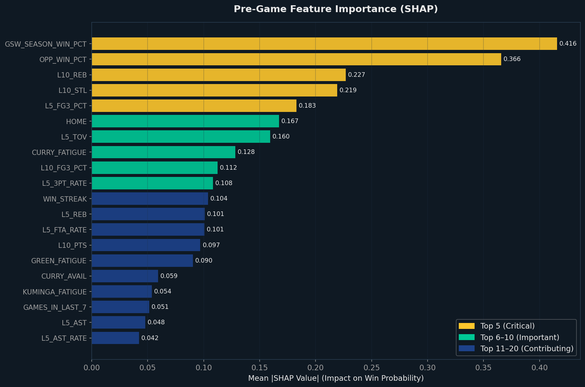

**How to read this chart:** Each bar represents one pre-game feature. Bar length = mean absolute SHAP value (average impact on win probability across all games). Gold bars are the top 5 most critical features; green bars are important secondary features; blue bars are contributing factors. A SHAP value of 0.10 means that feature shifts win probability by ±10 percentage points on average.

### 2.1 Feature Correlation with Winning

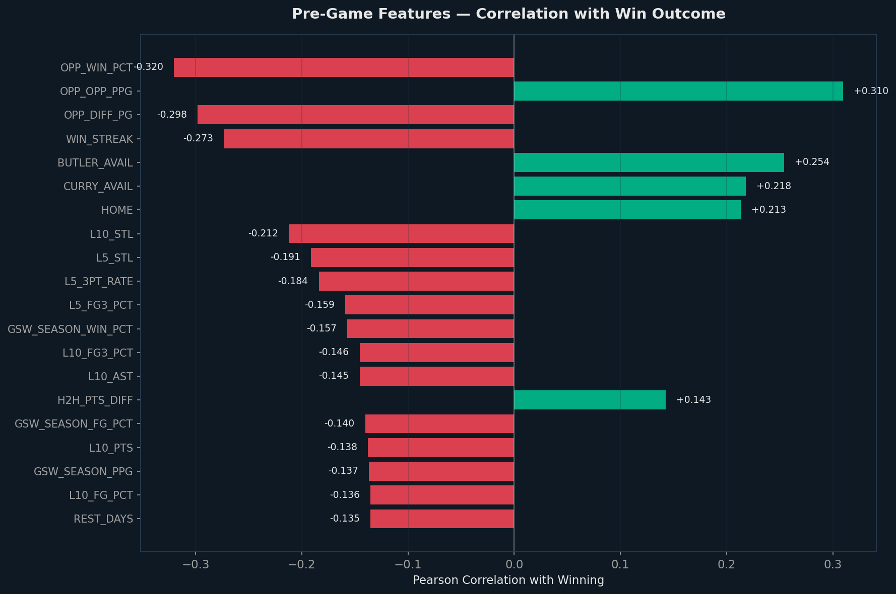

**How to read this chart:** Green bars extending right show features positively correlated with winning (higher values → more wins). Red bars extending left show negative correlations (higher values → more losses). The number beside each bar is the Pearson correlation coefficient (r). Values above |0.20| are meaningful; above |0.35| are strong.

| Feature | Correlation (r) | Interpretation |
|---|---|---|
| OPP_WIN_PCT | -0.320 | Strong: Higher → more losses |
| OPP_OPP_PPG | +0.310 | Strong: Higher → more wins |
| OPP_DIFF_PG | -0.298 | Moderate: Higher → more losses |
| WIN_STREAK | -0.273 | Moderate: Higher → more losses |
| BUTLER_AVAIL | +0.254 | Moderate: Higher → more wins |
| CURRY_AVAIL | +0.218 | Moderate: Higher → more wins |
| HOME | +0.213 | Moderate: Higher → more wins |
| L10_STL | -0.212 | Moderate: Higher → more losses |
| L5_STL | -0.191 | Moderate: Higher → more losses |
| L5_3PT_RATE | -0.184 | Moderate: Higher → more losses |

## 3. SHAP Beeswarm — Every Game Explained

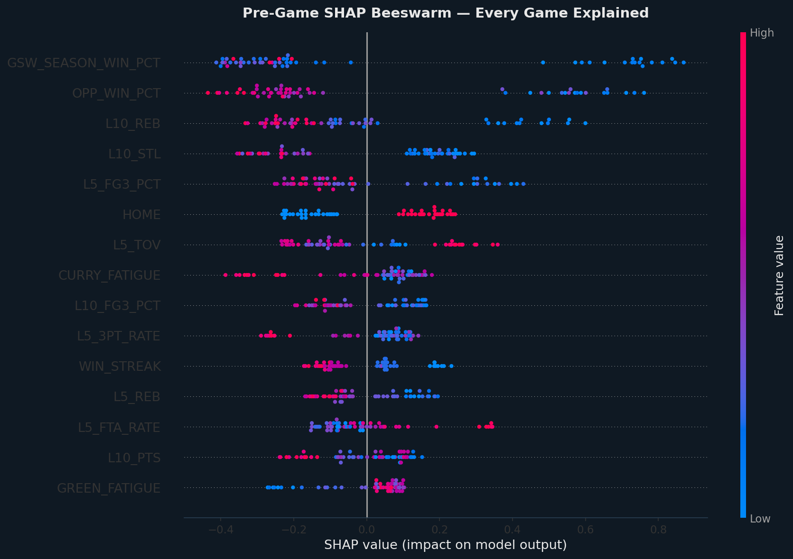

**How to read this chart:** Each dot is one game. Features are listed vertically (most important at top). Dots pushed **right** increased the model's win probability; dots pushed **left** decreased it. Color indicates the feature's actual value: **red = high value, blue = low value**.

**Key patterns to look for:**
- If a feature shows red dots on the right and blue dots on the left (e.g., L5_WIN_PCT), higher values of that feature predict wins
- If reversed (e.g., OPP_WIN_PCT), higher values predict losses — facing stronger opponents lowers win probability
- Tight clusters = consistent, predictable effect. Spread = variable impact depending on game context

## 4. Pre-Game Win Probability Timeline

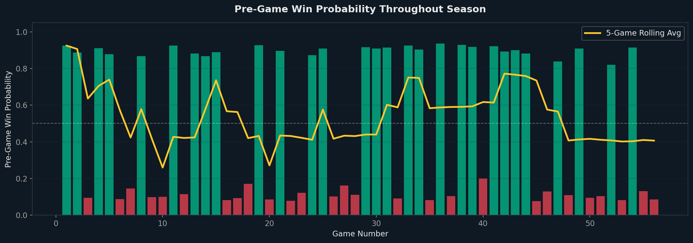

**How to read this chart:** Each bar is one game — **green bars** are actual wins, **red bars** are actual losses. Bar height = the model's pre-game win probability. The **gold line** is the 5-game rolling average.

**What to look for:**
- **Tall green bars:** High-confidence wins — the model expected this win and was correct
- **Short green bars:** Upset wins — the model gave low odds but the Warriors won anyway
- **Tall red bars:** Surprise losses — the model expected a win but the Warriors lost (coaching review candidates)
- **Short red bars:** Expected losses — the model correctly predicted a tough game
- **Gold line trend:** Rising = improving form; falling = declining form

## 5. Season Momentum Analysis

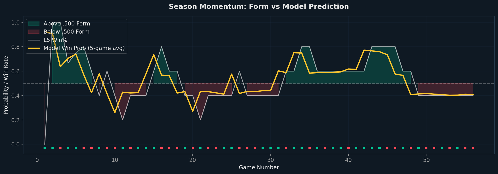

**How to read this chart:** The **white line** is the Warriors' actual L5 win percentage (recent form). The **gold line** is the model's 5-game average predicted win probability. **Green shading** above 0.50 indicates hot stretches; **red shading** below 0.50 indicates cold stretches. Colored squares along the bottom mark individual wins (green) and losses (red).

**Key insight:** When the gold line (model) diverges from the white line (reality), it suggests the team is either getting lucky (gold < white) or unlucky (gold > white). Sustained divergence often corrects itself.

## 6. Win Probability vs Opponent Strength

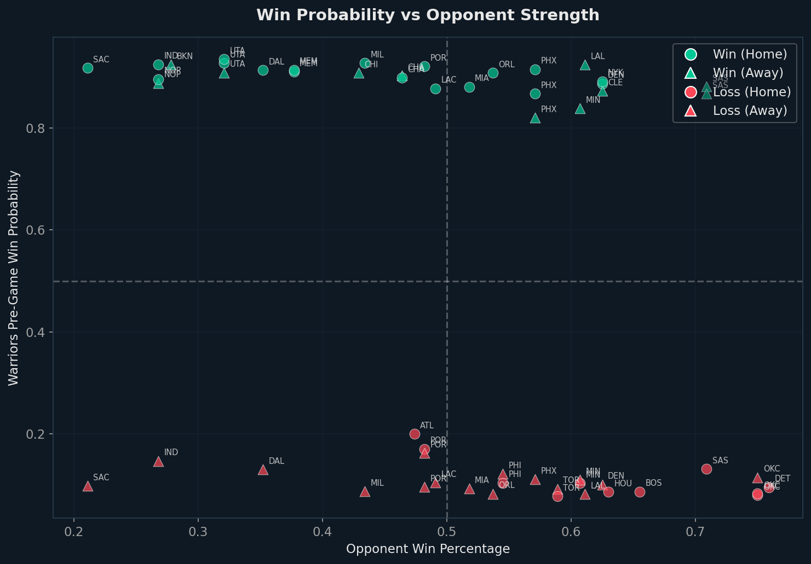

**How to read this chart:** Each point is one game. X-axis = opponent's season win percentage (stronger teams to the right). Y-axis = the model's pre-game win probability for the Warriors. **Circles = home games; triangles = away games.** Green = actual win; red = actual loss.

**Quadrant interpretation:**
- **Upper-left:** High win probability vs weak opponents — expected wins
- **Lower-right:** Low win probability vs strong opponents — expected losses
- **Upper-right:** High win probability vs strong opponents — Warriors at their best
- **Lower-left (green dots):** Upset victories over opponents the model feared

## 7. Home Court Advantage

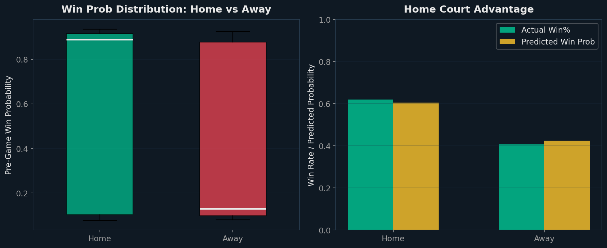

**How to read the left panel:** Box plots show the distribution of predicted win probabilities for home games vs away games. The box shows the interquartile range (middle 50%); the line inside is the median. If the home box is higher, the model has learned a meaningful home-court advantage.

**How to read the right panel:** Side-by-side comparison of actual win rates (green) vs model-predicted average probabilities (gold). If these are close, the model is well-calibrated for home/away splits.

| Split | Games | Actual Win% | Model Avg Prob |
|---|---|---|---|
| Home | 29 | 62.1% | 60.5% |
| Away | 27 | 40.7% | 42.5% |
| **Advantage** | — | **+21.3%** | **+18.0%** |

## 8. Model Calibration

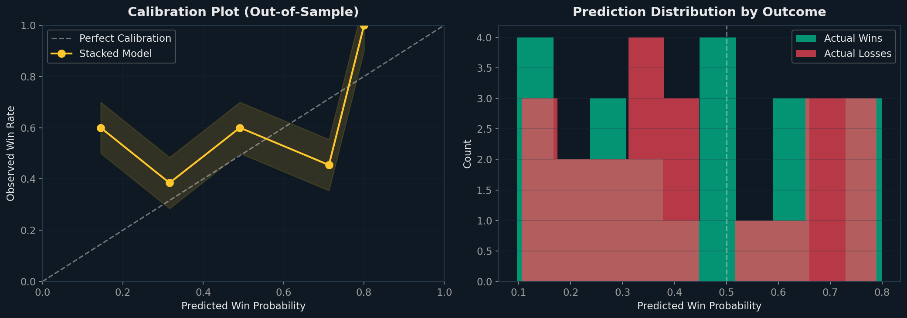

**How to read the calibration plot (left):** The dashed line represents perfect calibration — a model that predicts 60% win probability should win exactly 60% of those games. The gold line shows how the model's predictions map to actual outcomes. Points close to the diagonal = well-calibrated; points above = model underestimates win probability; below = overestimates.

**How to read the distribution plot (right):** Green histogram shows predicted probabilities for actual wins; red for actual losses. Good models push wins toward 1.0 and losses toward 0.0 with minimal overlap. Heavy overlap near 0.5 means the model struggles to distinguish those games.

## 9. Game Anatomy — SHAP Waterfall Decomposition

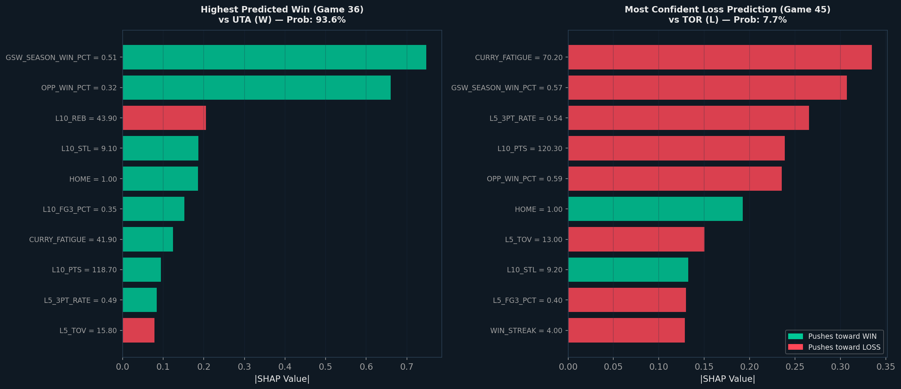

**How to read these charts:** Each bar shows one pre-game feature's SHAP contribution for a specific game. The label format is 'Feature = Value' (the actual pre-game value). **Green bars** pushed the prediction toward a win; **red bars** toward a loss. The left chart shows the game with the highest pre-game win probability; the right shows the game where the model most confidently predicted a loss.

**What to look for:** Compare the two charts to see which factors create the biggest difference between the team's best and worst predicted games. These are the highest-leverage controllable factors.

## 10. Model Predictions — Full Season Review

How the model would have predicted every game this season (using only pre-game info):

| # | Date | Opponent | H/A | Pre-Game Prob | Prediction | Actual | Correct? |
|---|---|---|---|---|---|---|---|
| 1 | Oct 21 | LAL | Away | 92.5% | W | W | ✅ |
| 2 | Oct 23 | DEN | Home | 88.8% | W | W | ✅ |
| 3 | Oct 24 | POR | Away | 9.5% | L | L | ✅ |
| 4 | Oct 27 | MEM | Home | 91.1% | W | W | ✅ |
| 5 | Oct 28 | LAC | Home | 87.8% | W | W | ✅ |
| 6 | Oct 30 | MIL | Away | 8.7% | L | L | ✅ |
| 7 | Nov 01 | IND | Away | 14.6% | L | L | ✅ |
| 8 | Nov 04 | PHX | Home | 86.8% | W | W | ✅ |
| 9 | Nov 05 | SAC | Away | 9.7% | L | L | ✅ |
| 10 | Nov 07 | DEN | Away | 10.0% | L | L | ✅ |
| 11 | Nov 09 | IND | Home | 92.6% | W | W | ✅ |
| 12 | Nov 11 | OKC | Away | 11.4% | L | L | ✅ |
| 13 | Nov 12 | SAS | Away | 88.2% | W | W | ✅ |
| 14 | Nov 14 | SAS | Away | 86.8% | W | W | ✅ |
| 15 | Nov 16 | NOP | Away | 88.9% | W | W | ✅ |
| 16 | Nov 18 | ORL | Away | 8.2% | L | L | ✅ |
| 17 | Nov 19 | MIA | Away | 9.2% | L | L | ✅ |
| 18 | Nov 21 | POR | Home | 17.0% | L | L | ✅ |
| 19 | Nov 24 | UTA | Home | 92.8% | W | W | ✅ |
| 20 | Nov 26 | HOU | Home | 8.6% | L | L | ✅ |
| 21 | Nov 29 | NOP | Home | 89.6% | W | W | ✅ |
| 22 | Dec 02 | OKC | Home | 7.9% | L | L | ✅ |
| 23 | Dec 04 | PHI | Away | 12.1% | L | L | ✅ |
| 24 | Dec 06 | CLE | Away | 87.3% | W | W | ✅ |
| 25 | Dec 07 | CHI | Away | 90.9% | W | W | ✅ |
| 26 | Dec 12 | MIN | Home | 10.3% | L | L | ✅ |
| 27 | Dec 14 | POR | Away | 16.2% | L | L | ✅ |
| 28 | Dec 18 | PHX | Away | 11.0% | L | L | ✅ |
| 29 | Dec 20 | PHX | Home | 91.6% | W | W | ✅ |
| 30 | Dec 22 | ORL | Home | 90.9% | W | W | ✅ |
| 31 | Dec 25 | DAL | Home | 91.4% | W | W | ✅ |
| 32 | Dec 28 | TOR | Away | 9.1% | L | L | ✅ |
| 33 | Dec 29 | BKN | Away | 92.5% | W | W | ✅ |
| 34 | Dec 31 | CHA | Away | 90.3% | W | W | ✅ |
| 35 | Jan 02 | OKC | Home | 8.3% | L | L | ✅ |
| 36 | Jan 03 | UTA | Home | 93.6% | W | W | ✅ |
| 37 | Jan 05 | LAC | Away | 10.4% | L | L | ✅ |
| 38 | Jan 07 | MIL | Home | 92.8% | W | W | ✅ |
| 39 | Jan 09 | SAC | Home | 91.8% | W | W | ✅ |
| 40 | Jan 11 | ATL | Home | 19.9% | L | L | ✅ |
| 41 | Jan 13 | POR | Home | 92.2% | W | W | ✅ |
| 42 | Jan 15 | NYK | Home | 89.2% | W | W | ✅ |
| 43 | Jan 17 | CHA | Home | 89.9% | W | W | ✅ |
| 44 | Jan 19 | MIA | Home | 88.1% | W | W | ✅ |
| 45 | Jan 20 | TOR | Home | 7.7% | L | L | ✅ |
| 46 | Jan 22 | DAL | Away | 12.9% | L | L | ✅ |
| 47 | Jan 25 | MIN | Away | 83.9% | W | W | ✅ |
| 48 | Jan 26 | MIN | Away | 10.9% | L | L | ✅ |
| 49 | Jan 28 | UTA | Away | 90.9% | W | W | ✅ |
| 50 | Jan 30 | DET | Home | 9.5% | L | L | ✅ |
| 51 | Feb 03 | PHI | Home | 10.3% | L | L | ✅ |
| 52 | Feb 05 | PHX | Away | 82.0% | W | W | ✅ |
| 53 | Feb 07 | LAL | Away | 8.1% | L | L | ✅ |
| 54 | Feb 09 | MEM | Home | 91.5% | W | W | ✅ |
| 55 | Feb 11 | SAS | Home | 13.1% | L | L | ✅ |
| 56 | Feb 19 | BOS | Home | 8.6% | L | L | ✅ |

*In-sample: 56/56 correct (100.0%). Out-of-sample (CV): 23/45 (51.1%).*

## 11. What This Enables — Next Phases

This pre-game predictor is the foundation for the remaining GSIS components:

| Phase | Model | Status | Uses M1 Output? |
|---|---|---|---|
| **Phase 1** | Pre-Game Win Predictor | ✅ Complete | — |
| Phase 2 | Fatigue Manager (M5) | 🔜 Next | Fatigue features feed into M1 |
| Phase 3 | Opponent Classifier (M3) | 📋 Planned | Opponent cluster as M1 feature |
| Phase 4 | Player Forecaster (M4) | 📋 Planned | Individual predictions complement M1 |
| Phase 5 | Lineup Optimizer (M2) | 📋 Planned | M1 validates lineup choices |
| Phase 6 | Game-Day Brief | 📋 Planned | Integrates all models |

---

## Appendix: Glossary

| Term | Definition |
|---|---|
| **Stacked Ensemble** | A meta-learning technique that trains multiple base models and combines their predictions via a second-level model |
| **Time-Series CV** | Cross-validation that respects temporal order — never trains on future data to predict the past |
| **SHAP Value** | Each feature's marginal contribution to a specific prediction, derived from cooperative game theory |
| **Brier Score** | Mean squared error between predicted probabilities and actual binary outcomes (0 = perfect, 0.25 = random) |
| **AUC-ROC** | Area Under the Receiver Operating Characteristic curve — measures discrimination regardless of threshold |
| **Log-Loss** | Cross-entropy loss — heavily penalizes confident wrong predictions |
| **Calibration** | How well predicted probabilities match observed frequencies (a 60% prediction should win 60% of the time) |
| **Meta-Learner** | The second-level model that learns optimal weights for combining base model predictions |
| **Rolling Average (L5/L10)** | Average of the last 5 or 10 games, updated before each game (shifted to avoid leakage) |
| **Fatigue Index** | Composite 0-100 score based on minutes load, rest days, schedule density, age, and travel |

---
*GSIS Phase 1 | Models: XGBoost, GradientBoosting, LogisticRegression, SHAP | Data: stats.nba.com 2025-26 | Generated: February 28, 2026*