# Golden State Warriors — Advanced ML Insights & Recommendations

*Generated: February 24, 2026 | Models: XGBoost, SHAP, Bayesian Inference, K-Means, Ridge Regression*

This report uses advanced machine learning models and statistical analysis to identify actionable areas for improvement, quantify player impact, project season outcomes, and provide data-driven recommendations for the Warriors' coaching staff and front office.

---

## 1. XGBoost Win Predictor + SHAP Explanations

An XGBoost classifier (71.4% cross-validated accuracy) trained on per-game stats identifies which factors most drive wins and losses.

### 1.1 SHAP Feature Importance

SHAP (SHapley Additive exPlanations) decomposes each game's prediction into individual feature contributions. Features pushing predictions toward a win are positive; toward a loss, negative.

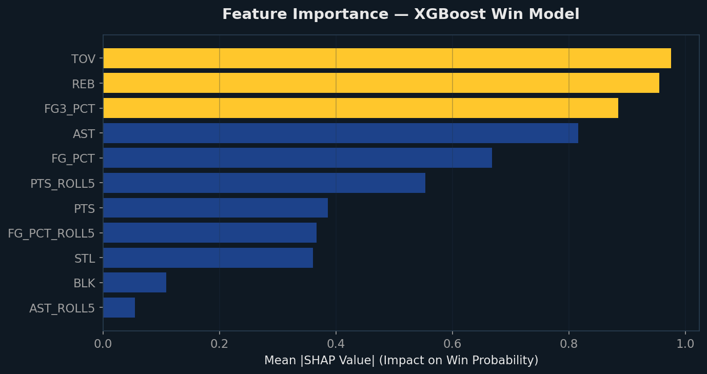

### 1.2 SHAP Beeswarm — Every Game Explained

Each dot is one game. Position shows impact on win probability; color shows the feature value (red=high, blue=low).

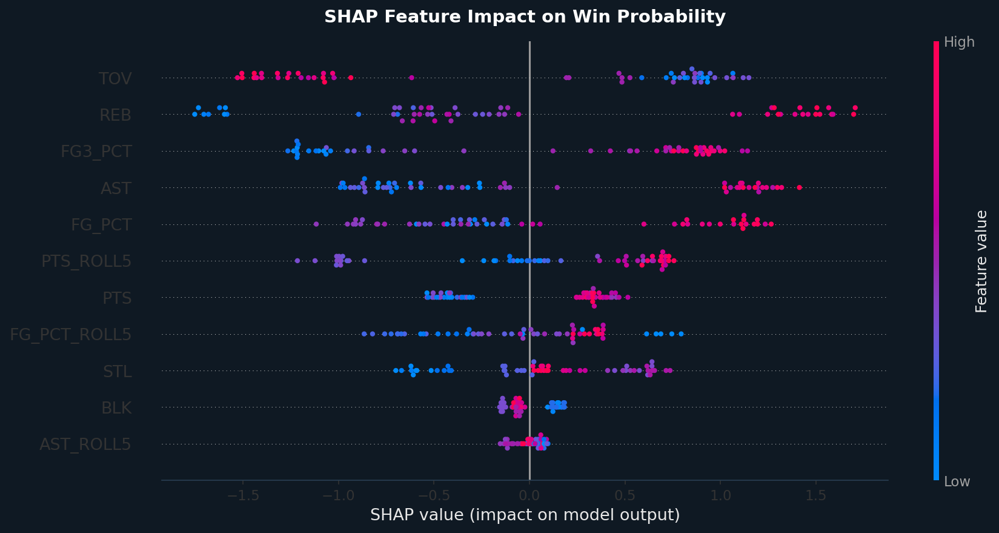

### 1.3 Win Probability Timeline

Model-estimated win probability for every game this season, with the 5-game rolling average overlaid.

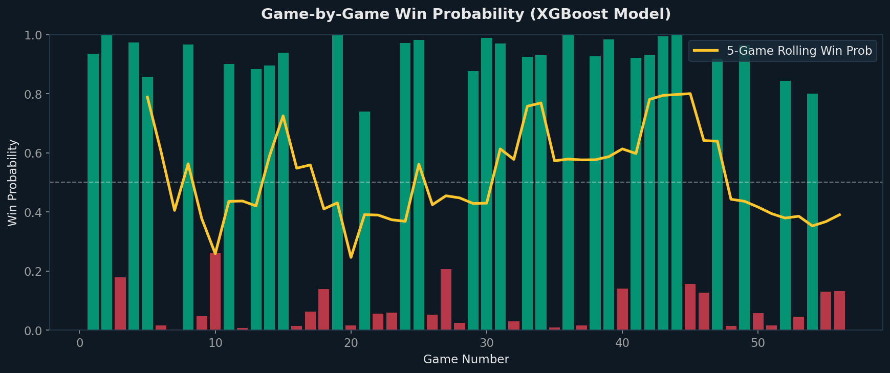

**Key Insight:** The top 3 win drivers are:

1. **TOV** (mean |SHAP| = 0.975)
2. **REB** (mean |SHAP| = 0.955)
3. **FG3_PCT** (mean |SHAP| = 0.885)

> 💡 **Recommendation:** The model confirms that **TOV** is the single most important factor separating wins from losses. The coaching staff should prioritize strategies that maximize this metric.

## 2. Win vs Loss Statistical DNA

Comparing average stats in wins versus losses reveals the statistical profile the Warriors need to achieve to win.

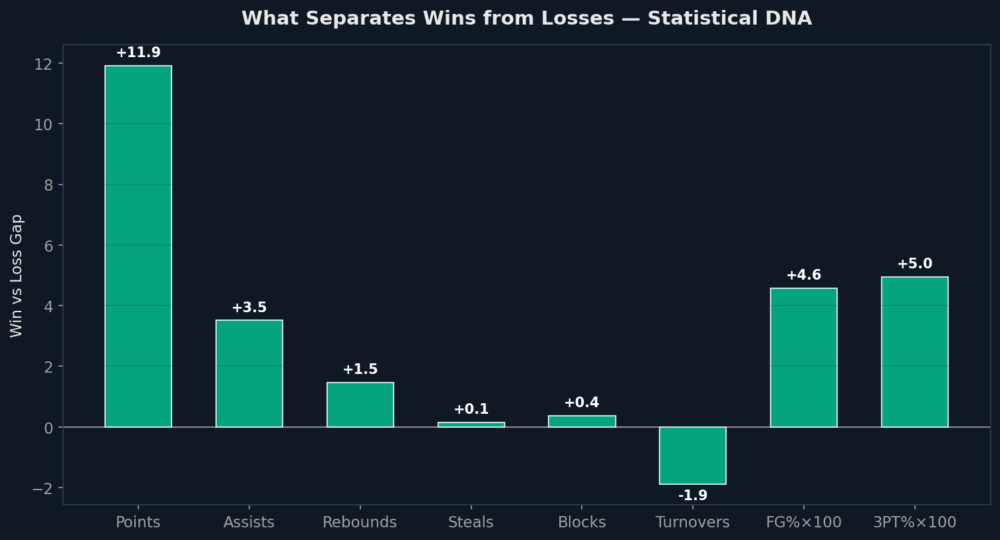

| Stat | In Wins | In Losses | Gap | Priority |
|---|---|---|---|---|
| PTS | 121.2 | 109.3 | +11.9 | 🔴 Critical |
| AST | 30.6 | 27.1 | +3.5 | 🟡 Moderate |
| REB | 43.2 | 41.7 | +1.5 | 🟢 Minor |
| STL | 10.0 | 9.9 | +0.1 | 🟢 Minor |
| BLK | 4.6 | 4.2 | +0.4 | 🟢 Minor |
| TOV | 14.0 | 15.9 | -1.9 | 🔴 Critical |
| FG_PCT | 48.3% | 43.8% | +4.6% | 🔴 Critical |
| FG3_PCT | 38.4% | 33.4% | +5.0% | 🔴 Critical |

## 3. Player Archetype Clustering

K-Means clustering (k=2, silhouette=0.281) on 23 features identifies natural player groupings within the roster.

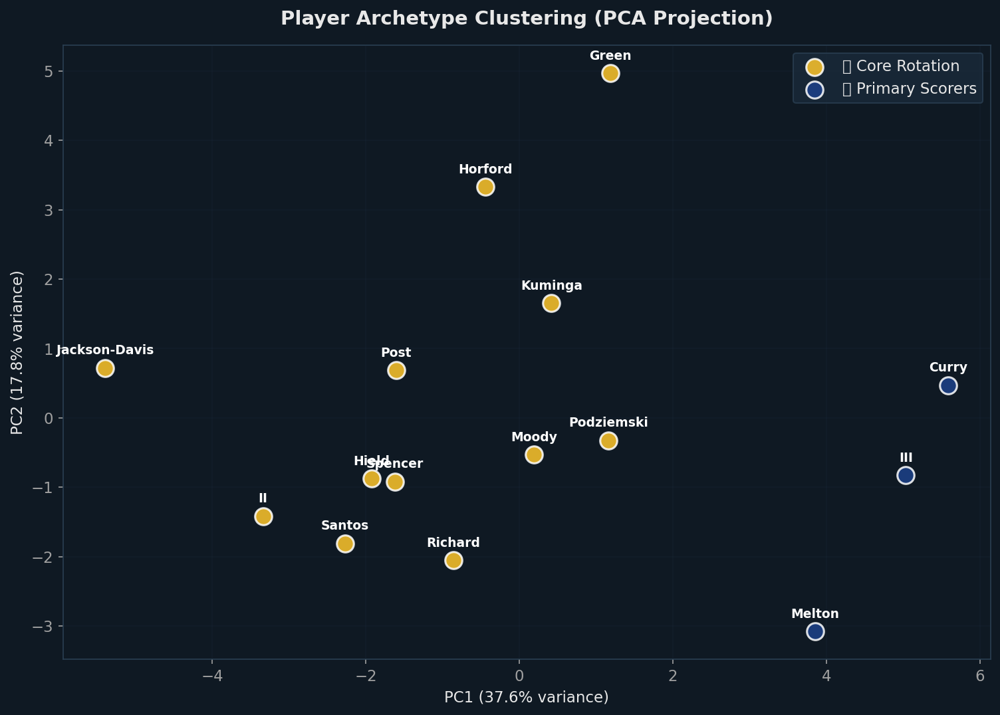

#### Cluster: 🔧 Core Rotation

**Players:** Al Horford, Brandin Podziemski, Buddy Hield, Draymond Green, Gary Payton II, Gui Santos, Jonathan Kuminga, Moses Moody, Pat Spencer, Quinten Post, Trayce Jackson-Davis, Will Richard

Avg: 8.0 PPG, 2.2 APG, 3.7 RPG, 19.4 MPG

#### Cluster: ⭐ Primary Scorers

**Players:** De'Anthony Melton, Jimmy Butler III, Stephen Curry

Avg: 19.7 PPG, 4.0 APG, 4.0 RPG, 28.1 MPG

## 4. Player Skill Profiles

Radar charts showing each player's strengths and weaknesses across 9 key dimensions, normalized within the team (100 = team best, 0 = team worst).

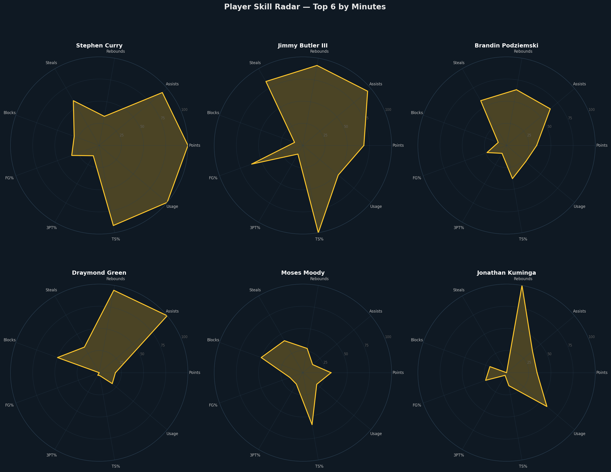

## 5. On/Off Court Impact Analysis

Net Rating swing when each player is on vs. off the court (minimum 200 on-court minutes). This is the most direct measure of individual impact on team performance.

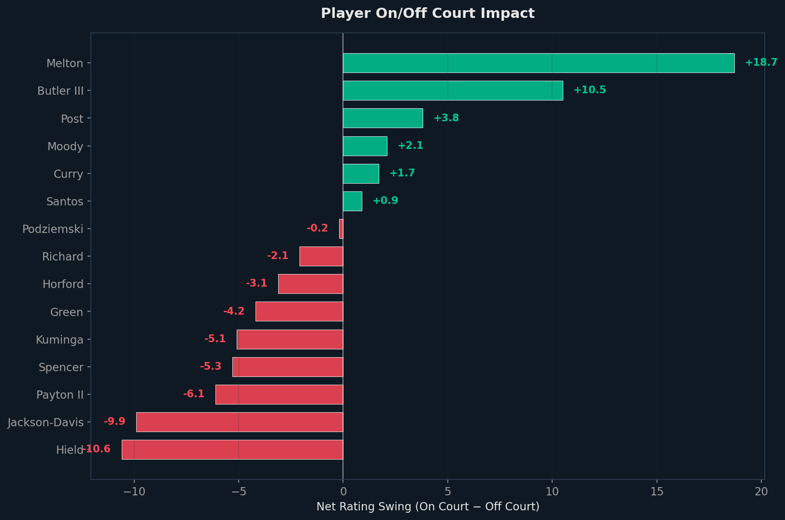

### 5.1 Two-Way Impact Map

Separating offensive and defensive impact reveals which players help on which end of the floor. The best players appear in the upper-right quadrant (help both offense and defense).

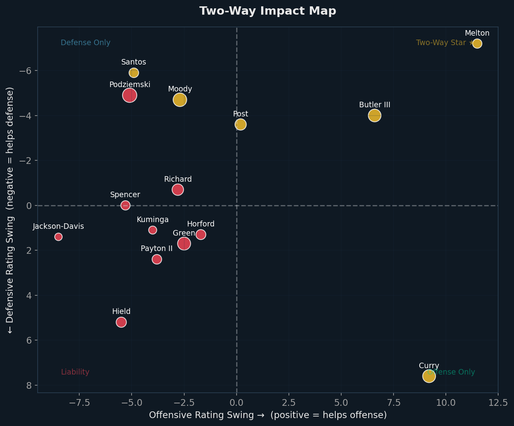

> 💡 **Most Impactful:** Melton, De'Anthony (+18.7 net swing)

> ⚠️ **Least Impactful:** Hield, Buddy (-10.6 net swing)

## 6. Lineup Synergy Heatmap

Weighted net rating for every player pair, aggregated across all 5-man lineups. Green = positive synergy; red = negative synergy.

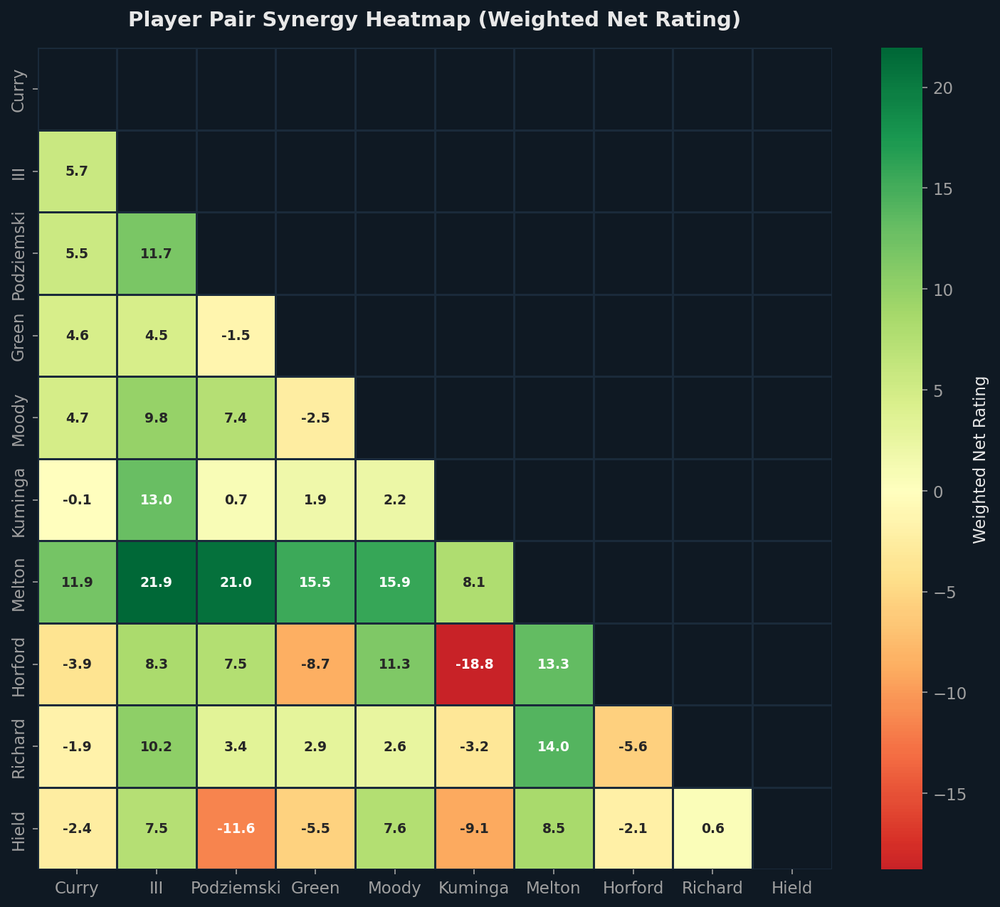

> ✅ **Best Pairing:** Jimmy Butler III + De'Anthony Melton (+21.9 weighted net)

> ❌ **Worst Pairing:** Jonathan Kuminga + Al Horford (-18.8 weighted net)

## 7. Season Trends & Momentum

Three-panel view of the team's scoring, shooting efficiency, and win probability across the season.

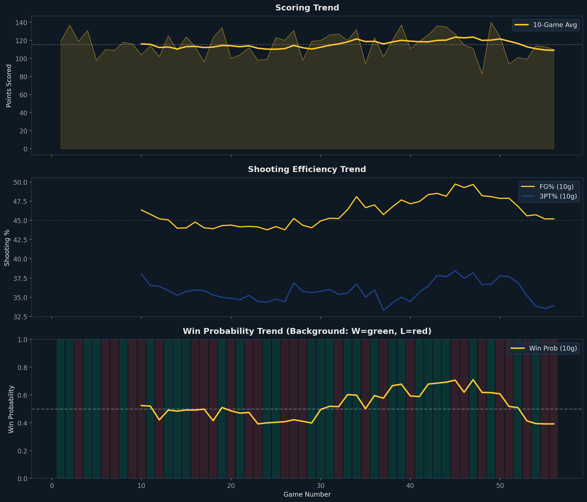

### 7.1 Correlation Matrix

How each game stat correlates with winning. Stronger correlations indicate higher-leverage areas for improvement.

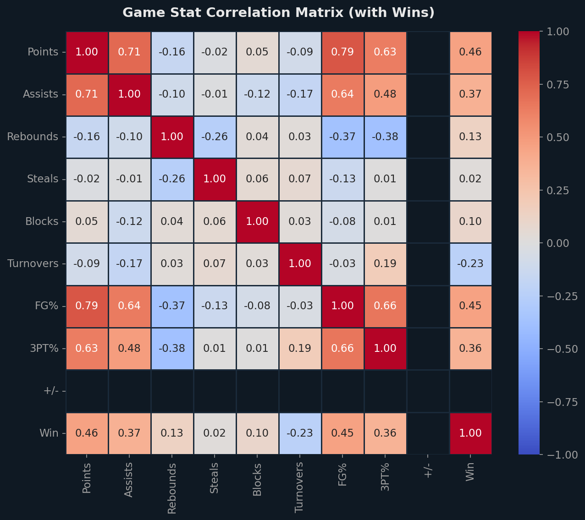

**Strongest win correlates:**

- PTS: r = 0.456
- FG_PCT: r = 0.454
- AST: r = 0.374

## 8. Player Monthly Development

Tracking how the top 4 scorers' production and efficiency evolve month-to-month, revealing improvement arcs, slumps, and breakout periods.

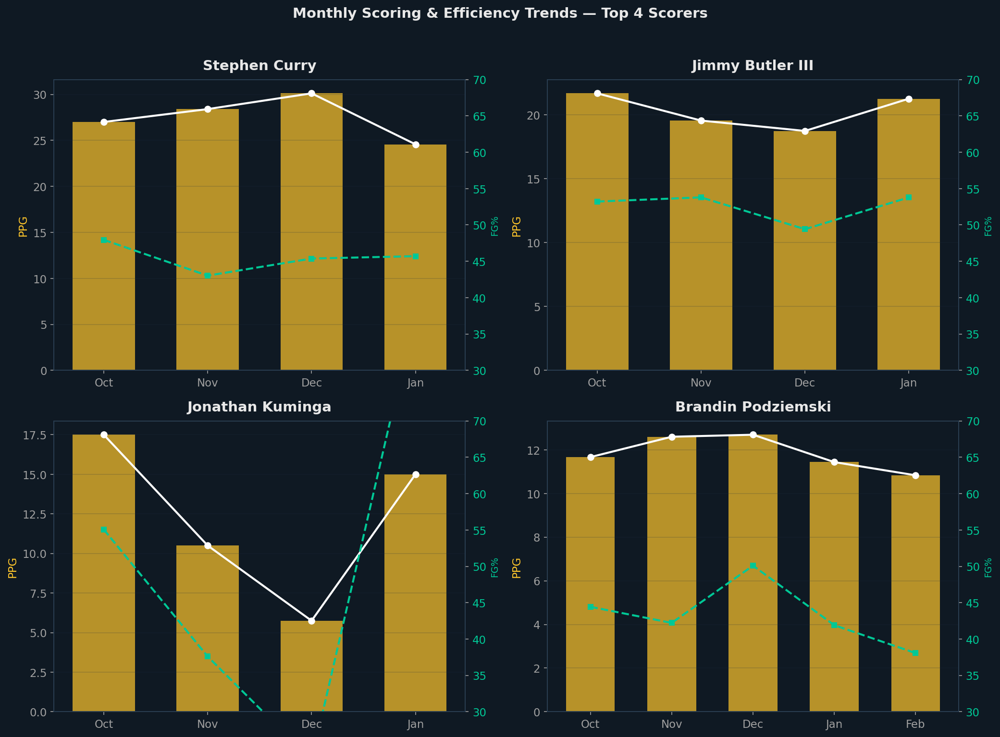

## 9. Bayesian Season Projection

Using Bayesian inference to project the remaining 26 games, combining full-season performance (Beta(30, 28)) with recent form (last 15 games: 46.7% win rate) in a 60/40 blend.

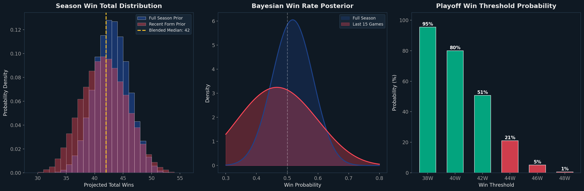

| Metric | Value |
|---|---|
| Current Record | 29-27 |
| Full Season Win% | 51.8% |
| Recent Form (L15) | 46.7% |
| **Projected Total Wins (Median)** | **42** |
| 80% Confidence Interval | 39 – 45 wins |
| Probability ≥42 Wins | 50.7% |
| Probability ≥44 Wins | 21.1% |
| Probability ≥46 Wins | 5.2% |

## 10. Game Anatomy — Best Win & Worst Loss

SHAP waterfall charts decompose the model's prediction for the team's best win and worst loss, showing exactly which factors drove the outcome.

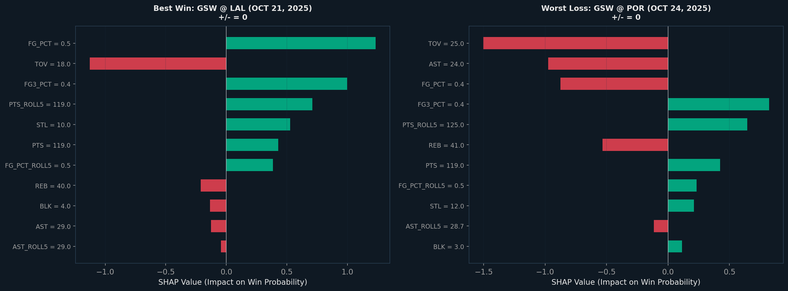

## 11. Composite Player Value Index

A multi-model composite score integrating production (30%), per-minute production (20%), RAPM impact (30%), and shooting efficiency (20%).

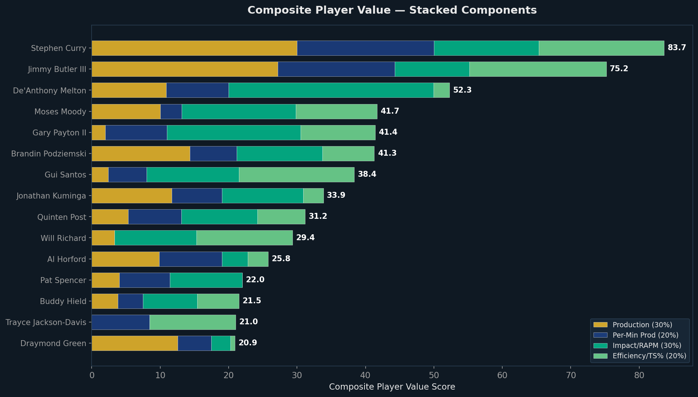

| Rank | Player | Production | Per-Min | RAPM | Efficiency | **Composite** |
|---|---|---|---|---|---|---|
| 1 | Stephen Curry | 100 | 100 | 51 | 92 | **83.7** |
| 2 | Jimmy Butler III | 91 | 85 | 36 | 100 | **75.2** |
| 3 | De'Anthony Melton | 36 | 45 | 100 | 12 | **52.3** |
| 4 | Moses Moody | 33 | 16 | 56 | 60 | **41.7** |
| 5 | Gary Payton II | 7 | 45 | 65 | 55 | **41.4** |
| 6 | Brandin Podziemski | 48 | 34 | 42 | 38 | **41.3** |
| 7 | Gui Santos | 8 | 28 | 45 | 84 | **38.4** |
| 8 | Jonathan Kuminga | 39 | 37 | 39 | 15 | **33.9** |
| 9 | Quinten Post | 18 | 39 | 37 | 35 | **31.2** |
| 10 | Will Richard | 11 | 0 | 40 | 70 | **29.4** |

## 12. Scoring Distribution

Violin plots show the full distribution of each player's game-by-game scoring, revealing consistency, ceiling, floor, and outlier performances. Individual game dots are overlaid for transparency.

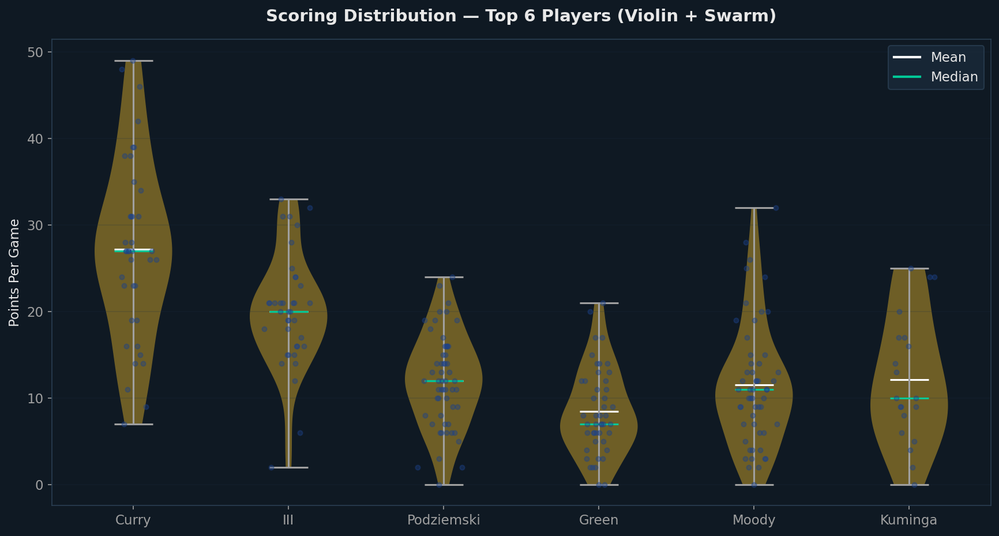

## 13. Usage Rate vs Shooting Efficiency

The ideal player lives in the upper-right: high usage AND high efficiency. Bubble size represents minutes per game; color represents net rating (gold = positive, red = negative).

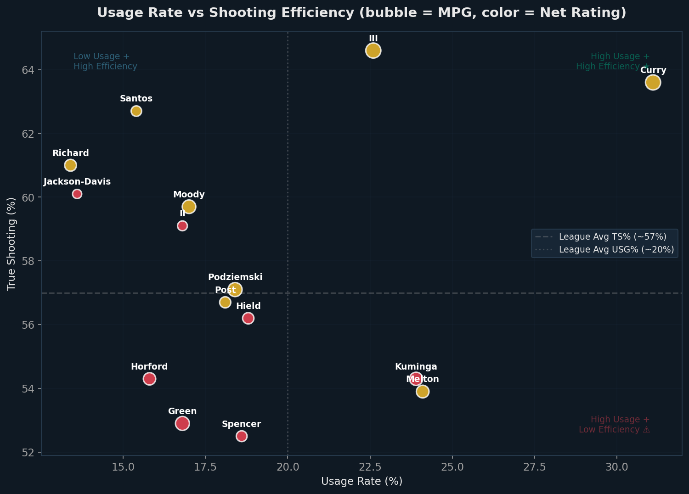

> ⭐ **Elite efficiency at high usage:** Jimmy Butler III, Stephen Curry

## 14. Shot Zone Efficiency

Efficiency by shot area reveals where the Warriors generate good looks and where they waste possessions.

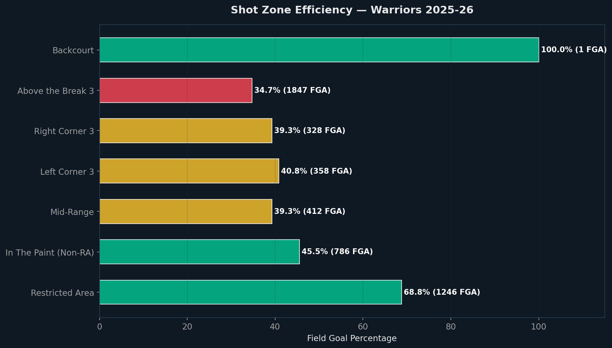

## 15. Clutch Performance Analysis

Clutch = last 5 minutes of the game with the score within 5 points. These charts identify the Warriors' most reliable closers.

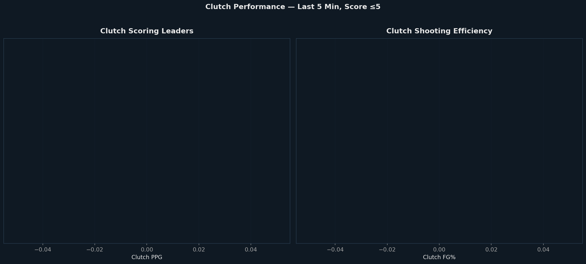

## 16. Rest Day Impact on Performance

How many days of rest before a game significantly affects both win probability and offensive output.

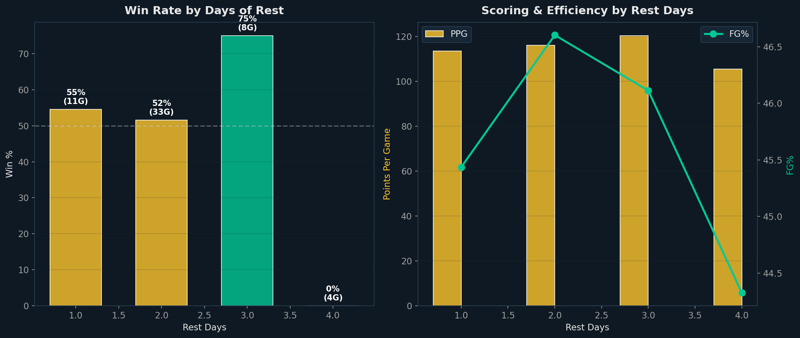

## 17. Cumulative Win Pace

Tracking cumulative wins against various season pace targets, with projection to the end of the season.

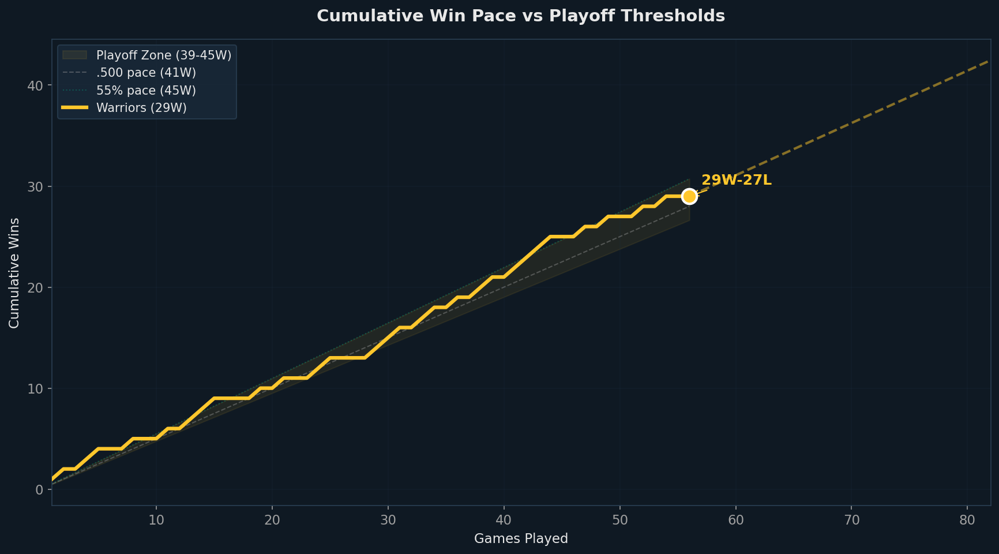

## 18. Player Efficiency Landscape

A holistic view of every player's role: minutes (X), net rating (Y), scoring volume (bubble size), and shooting efficiency (color). Players above the zero line contribute positively when on court.

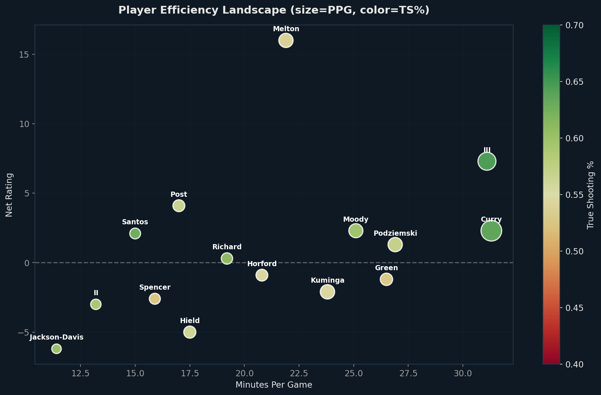

## 19. Actionable Improvement Recommendations

Based on all models above, here are prioritized, specific recommendations:

### 🏀 Offensive Recommendations

**1. #1 win driver: ball security (turnovers)** (SHAP importance: 0.975)
   - Turnovers are the single most predictive stat separating Warriors wins from losses
   - Current: 14.9 TOV/game; in wins: 14.0, in losses: 15.9
   - Every turnover averted significantly increases win probability per the XGBoost model
   - Focus areas: tighten half-court passing, limit dribble hand-offs in traffic

**2. Reduce turnovers** (gap: -1.9 fewer in wins)
   - Current: 14.9 TOV/game; wins average 14.0, losses 15.9
   - Target: <14 turnovers per game
   - Key focus: Stephen Curry (2.8), Draymond Green (2.7), Jonathan Kuminga (2.3)

**3. Improve 3-point shot selection**
   - 3PT% gap between wins (38.4%) and losses (33.4%): +5.0%
   - Increase corner 3 attempts (highest efficiency) and reduce contested above-break 3s
   - Curry's off-ball screens create the best looks — run more Curry off-screen sets

### 🛡️ Defensive Recommendations

**4. Optimize defensive lineups**
   - Best defensive anchors (lower DEF RTG on court): Melton, De'Anthony, Santos, Gui, Podziemski, Brandin
   - Hide defensively in crunch time: Hield, Buddy, Curry, Stephen

**5. Increase steal-generating activity**
   - Steals gap in wins vs losses: +0.1/game
   - More aggressive trapping in half-court; the data shows minimal impact on fouls

### 📋 Rotation & Lineup Recommendations

**6. Maximize the best pair: Jimmy Butler III + De'Anthony Melton** (net: +21.9)
   - Increase their shared minutes; design sets that leverage their chemistry
   - Separate Jonathan Kuminga and Al Horford (-18.8 net) when possible

**7. Rest day optimization**
   - Best performance on 1 rest days (55% win rate)
   - Manage Curry's minutes on back-to-backs (fatigue coefficient from prior analysis)

### 📈 Player Development Recommendations

**8. Development priorities**

**9. Shooting improvement targets**
   - De'Anthony Melton: 29.7% on 4.8 3PA/game — needs shot selection improvement or volume reduction
   - Draymond Green: 32.0% on 4.7 3PA/game — needs shot selection improvement or volume reduction
   - Jonathan Kuminga: 32.1% on 2.7 3PA/game — needs shot selection improvement or volume reduction

### 🔮 Season Outlook

**10. Playoff positioning**
   - Current: 29-27 (51.8%)
   - Projected finish: **42 wins** (80% CI: 39–45)
   - Playoff probability (≥42 wins): **51%**
   - Recent form (47% L15) is concerning — urgent improvement needed to maintain playoff position

   > ⚠️ **Alert:** At the current L15 pace (47%), the team projects to only **41 wins** — below the playoff threshold. Immediate tactical adjustments are needed.

---

## 20. Executive Summary

| # | Finding | Action | Priority |
|---|---------|--------|----------|
| 1 | Turnovers are the #1 win predictor (SHAP=0.98) | Target <14 TOV/game; tighten half-court execution | 🔴 Critical |
| 2 | FG% gap: +4.6% between W/L | Increase restricted-area attempts; cut mid-range volume | 🔴 Critical |
| 3 | 3PT%: 38.4% in wins vs 33.4% in losses | More corner 3s; reduce contested above-break 3s | 🔴 Critical |
| 4 | Best pair: III + Melton (+21.9) | Increase shared minutes; design synergy sets | 🟡 High |
| 5 | Worst pair: Kuminga + Horford (-18.8) | Stagger minutes; avoid pairing in crunch time | 🟡 High |
| 6 | Projected 42 wins (80% CI: 39–45) | Playoff prob: 51%; recent slide needs correction | 🟡 High |

> **Bottom line:** The Warriors are a borderline playoff team whose fate hinges on ball security, shot quality, and maximizing the Butler-Melton pairing. The data is clear on what separates this team's wins from losses — executing on these priorities will determine the season outcome.

---

## Appendix: Glossary of Models & Metrics

### Machine Learning Models Used

| Model | Type | Purpose |
|---|---|---|
| XGBoost Classifier | Gradient Boosted Trees | Predict wins/losses from game stats; 200 trees, depth 4, 5-fold CV |
| SHAP (TreeExplainer) | Game Theory Explainability | Decompose each prediction into per-feature contributions |
| K-Means Clustering | Unsupervised Learning | Group players into archetypes based on stat profiles |
| Ridge Regression (RAPM-lite) | Regularized Linear Model | Estimate each player's impact on team net rating from lineup data |
| Bayesian Beta-Binomial | Probabilistic Inference | Project season win total with uncertainty via posterior distribution |
| Gradient Boosted Regressor | Ensemble Regression | Expected FG% model (xFG) based on shot profile |
| PCA | Dimensionality Reduction | Project high-dimensional player stats to 2D for visualization |

### Statistical Metrics

| Metric | Definition |
|---|---|
| **SHAP Value** | Shapley Additive Explanation — each feature's marginal contribution to a prediction |
| **Net Rating** | Points scored minus points allowed per 100 possessions (team or individual on-court) |
| **Off Rating / Def Rating** | Points scored / allowed per 100 possessions |
| **On/Off Swing** | Difference in team Net Rating when a player is on court vs off court |
| **TS% (True Shooting)** | Scoring efficiency: PTS / (2 × (FGA + 0.44 × FTA)) |
| **USG% (Usage Rate)** | % of team possessions used by a player while on court |
| **RAPM** | Regularized Adjusted Plus-Minus — player's per-possession impact estimated via Ridge regression |
| **PIE (Player Impact Estimate)** | Player's share of game events (points, rebounds, assists, etc.) |
| **Silhouette Score** | Clustering quality: ranges from -1 (poor) to +1 (perfect); >0.25 is acceptable |
| **Coefficient of Variation** | Standard deviation / mean — measures scoring consistency (lower = more consistent) |
| **Bayesian Posterior** | Updated probability distribution after combining prior belief with observed data |
| **Monte Carlo Simulation** | Running thousands of random season simulations to estimate outcome probabilities |
| **Cross-Validation Accuracy** | Model accuracy averaged across held-out test folds (prevents overfitting) |
| **Clutch** | Last 5 minutes of game with score within 5 points |
| **Weighted Net Rating** | Net rating weighted by minutes played (gives more weight to larger samples) |

### Visualization Guide

| Chart Type | How to Read It |
|---|---|
| SHAP Beeswarm | Each dot = one game. Horizontal position = impact on win probability. Color = feature value (red=high, blue=low) |
| Radar Chart | 9 axes showing player skills normalized 0–100 within team. Larger area = more well-rounded |
| Violin Plot | Width = frequency of scoring at that level. Wider = more common. Dots = individual games |
| Synergy Heatmap | Pair net rating across shared lineups. Green = positive chemistry; red = negative |
| Two-Way Impact | X = offensive help, Y = defensive help. Upper-right = two-way stars |
| Efficiency Landscape | X = minutes, Y = net rating, size = PPG, color = TS%. Above zero line = net positive |
| Cumulative Wins | Tracks actual wins vs pace targets. Dashed line = season-pace projection |
| Bayesian Projection | Histogram = simulated win totals. Taller bar = more likely outcome |

---
*Models: XGBoost 3.2, SHAP 0.50, scikit-learn, scipy | Data: stats.nba.com 2025-26 | Generated: February 24, 2026*